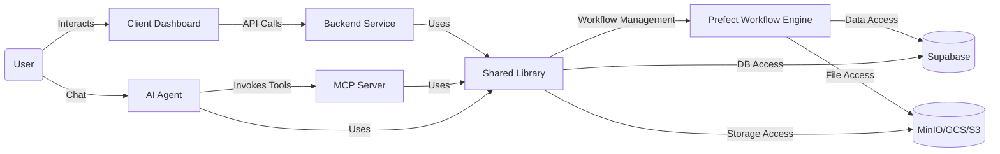
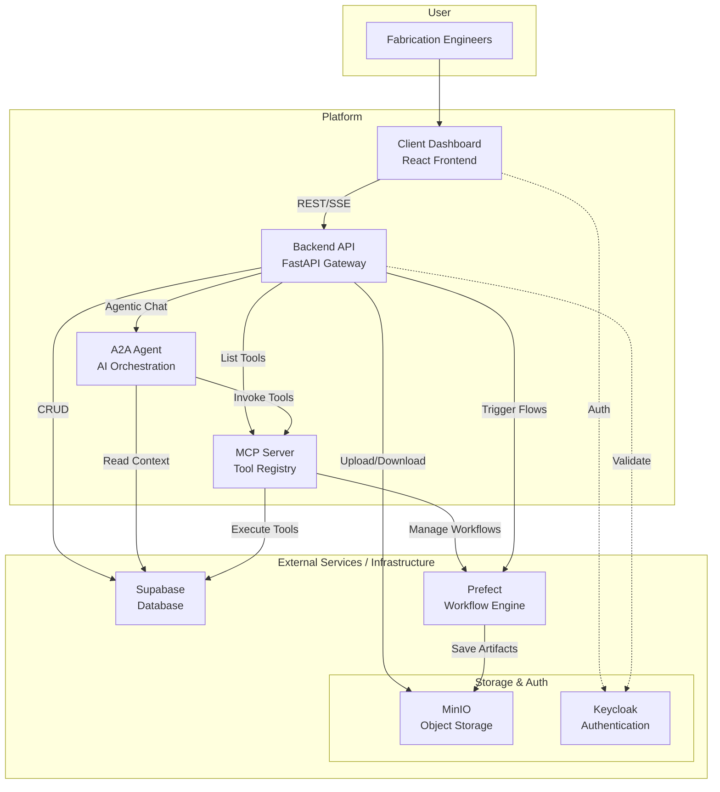
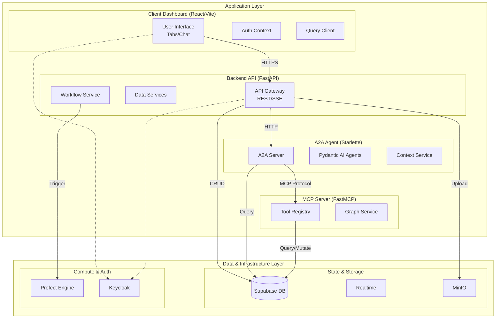
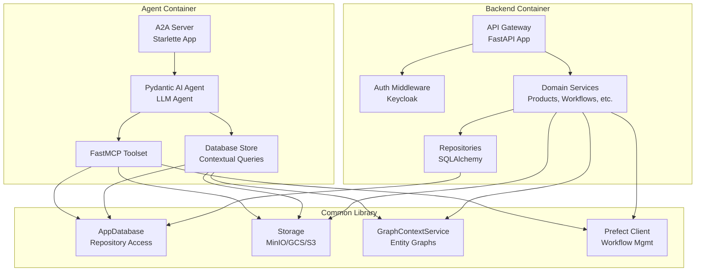

<!--
AUTO-GENERATED from semi
Last sync: 2026-06-29 07:05:28 UTC
Source commit: 40d1066380706703480d41d1dbec2df74343a8a6
DO NOT EDIT MANUALLY - Run ./sync_knowledge.sh to update
-->

# semi Architecture

## Overview

## Architecture

The system architecture is available in the [Technical Architecture documentation](https://emergenceai.atlassian.net/wiki/spaces/SEMI/pages/1038614585/Technical+Architecture).

## Detailed Architecture

# Architecture Overview

## Introduction

This document provides a comprehensive overview of the architecture for the EM-Semi system, a platform designed to empower semiconductor fabrication engineers with AI-assisted data analysis and workflow management. It covers the system's components, technologies, data relationships, and architectural principles that enable seamless collaboration between engineers and AI agents.

## Project Context

### Layman's Context

The system acts as a smart workspace where fabrication engineers can upload data, analyze it, and ask questions to an AI assistant. It's like having a digital colleague who can see all your files, run complex calculations, and produces reports to you.

### Technology Deep Dive

- **Model Context Protocol (MCP):** MCP is a standardized protocol for exchanging context between AI models and applications. The Python SDK enables applications to expose resources (data endpoints), tools (functions), and structured outputs (Pydantic models) to LLMs. MCP servers manage context, tool invocation, and interactive tasks, supporting advanced features like task metadata, structured output, and graph-based context engineering.
- **A2A Agents:** The A2A protocol enables agent-to-agent communication, supporting message passing, task management, and artifact exchange. Agents are described by "agent cards" (name, description, skills, URL) and expose skills for discovery and invocation. The protocol supports streaming, MCP integration, and agent networks for collaborative workflows.
- **Pydantic AI Agents:** Pydantic AI provides a FastAPI-like framework for building structured, type-safe AI agents. Agents use Pydantic models for input/output validation, dependency injection, and tool registration. The framework supports multimodal inputs (text, document, image, audio, video), RAG search, and graph-based workflow visualization.

### Shared Logic

- **Database Access (Supabase):** The `AppDatabase` class in `common_semi.db` provides unified access to all entity repositories (Organization, Product, Task, Message, Artifact, Alert, etc.), enabling CRUD operations and graph traversal.
- **Storage:** The `Storage` class in `common_semi.storage` abstracts file uploads/downloads to MinIO, GCS, or S3 buckets, supporting secure, scalable object storage for data files and artifacts.
- **Authorization:** The shared library supports organization/user relationships, permission checks, and role-based access control, leveraging Keycloak for OIDC authentication.
- **Workflow Management:** Integration with Prefect enables triggering, editing and monitoring long-running analyses, with support for observability, retries and error handling.

### Data Relationships

- **Entities:** Core models include Organization, User, Product, TechnologyNode, Foundry, BusinessUnit, Alert, Task, Message, Artifact, Part, and PushNotificationConfig, etc. Relationships are defined via SQLAlchemy ORM, supporting directed graphs for context engineering (e.g., products belong to organizations, tasks reference users and contexts, messages and artifacts are linked to tasks).
- **Graph Context Service:** The `GraphContextService` builds graph-structured workspace context, resolving @mentions and constructing entity graphs for AI chat and tool invocation.

### Component Boundaries

- **Backend:** FastAPI-based service orchestrates authentication, authorization, CRUD, workflow management, and real-time updates. It exposes REST endpoints for all business logic and delegates agentic operations to the A2A Agent, database/storage operations to the shared library.
- **Agent:** Handles agentic chat, session management, context engineering, and MCP tool invocation via A2A protocol. Integrates with Supabase and GraphContextService for rich prompt construction.
- **MCP (Tool Registry):** FastMCP server registers tools, exposes workflow, database operations for LLM-driven interactions. Integrates with Supabase and Prefect for workflow execution.
- **Client Dashboard (Frontend):** React/Vite/Tailwind app provides a workspace UI with tabs for data sources, workflows, reports, alerts, and sidebar chat. Integrates with backend via REST/SSE for real-time updates and context-driven interactions.
- **Shared Library:** Centralized library for database, storage, workflows, and authorization operations.

## Architectural Drivers

### Functional Overview

The system enables semiconductor fabrication engineers to:

- Upload, connect, and manage data files (abstracted storage: MinIO, GCS, S3)
- Trigger and monitor long-running analyses (Prefect workflows)
- Receive alerts on threshold violations (Supabase events, Alerts)
- Explore UX for data, workflows, reports, and chat (React frontend)
- Interact with AI-powered chat (A2A Agent, FastMCP)
- Orchestrate agentic operations and context engineering (GraphContextService, MCP tools)

### Quality Attributes

- **Real-time Capability:** Supabase broadcasts events; backend subscribes and pushes updates via SSE to the frontend for instant feedback.
- **Scalability:** Microservices architecture (API Gateway, Agent, MCP, Frontend) enables independent scaling and deployment.
- **Fault Tolerance:** Prefect workflows support retries and error handling; alerts are generated for threshold violations and failures.
- **Security:** Keycloak OIDC for authentication; Casbin RBAC for authorization; secure storage and data access.
- **Observability:** Prefect logs, Supabase audit trails, and structured artifacts for traceability.

### Constraints

- **Local/Production Parity:** Docker Compose ensures consistent environment setup for local development, on-prem and production deployment.
- **Authentication:** Keycloak is required for OIDC-based user authentication and session management.
- **Shared Library:** All business logic, data access, and context engineering are centralized in the `common-semi` library for consistency and maintainability.

### Principles

- **Separation of Concerns:** API Gateway handles business logic and orchestration; Agent service is dedicated to agentic AI chat; MCP server manages tool registry and context.
- **Shared Library Strategy:** The `common-semi` library provides unified operations for database, storage, workflows, and authorization, eliminating duplication and ensuring consistency across services.
- **Graph-Structured Context:** Workspace context is modeled as a directed graph, enabling rich context engineering for AI agents and chat interactions.
- **Dependency Inversion:** The `common-semi` library is used by all services to ensure consistency and maintainability.
- **Dependency Injection:** All services use dependency injection to ensure consistency and maintainability.
- **Single Responsibility:** Each service has a single responsibility, making it easier to maintain and scale.
- **DRY (Don't Repeat Yourself):** The shared library centralizes common logic, preventing code duplication across services.
- **KISS (Keep It Simple, Stupid):** Designs prioritize simplicity, avoiding unnecessary complexity in architecture and code.
- **YAGNI (You Aren't Gonna Need It):** Features are implemented only when required, preventing over-engineering.
- **Interface Segregation Principle (ISP):** APIs and interfaces are kept specific and minimal, avoiding bloated contracts.
- **Composition Over Inheritance:** Complex objects are built through composition (e.g., Pydantic models) rather than inheritance hierarchies.
- **Law of Demeter:** Code avoids deep coupling by limiting knowledge of object internals.
- **Single Source of Truth (SSOT):** Data entities and logic are mastered in one place (the shared library and Supabase) to prevent inconsistencies.
- **ACID Transactions:** Database operations adhere to ACID (atomic, consistency, isolation, durability) properties for reliable transactions.
- **Twelve-Factor App:** The containerized deployment with Docker Compose follows principles like codebase management, dependency isolation, environment-based config, stateless processes, and dev/prod parity.
- **Type Safety:** Pydantic models ensure type safety and validation for data structures across services.

## Technology Deep Dive

### Model Context Protocol (MCP)

The Model Context Protocol (MCP) is an open protocol that standardizes how applications provide context to large language models (LLMs), enabling seamless integration with data sources and tools for building AI agents and complex workflows. The Python SDK implements MCP, enabling applications to expose resources (data endpoints), tools (functions), and structured outputs (Pydantic models) to LLMs. MCP servers manage context, tool invocation, and interactive tasks, supporting advanced features like task metadata, structured output, and graph-based context engineering.

Key implementation details from the Python SDK:

- **FastMCP Framework:** Provides a simple way to create MCP servers with tools, resources, and prompts. Servers can be run directly or via stdio/SSE transports.
- **Tool Registration:** Tools are registered using decorators like `@mcp.tool()`, allowing LLMs to invoke functions with structured inputs/outputs.
- **Lifespan Management:** Supports startup/shutdown hooks with type-safe dependency injection using context managers and dataclasses.
- **Client Integration:** Clients can connect via stdio or HTTP transports to list and invoke tools, resources, and prompts.
- **Example Usage:** Direct execution servers, completion clients, and integration with Claude Desktop for tool invocation.

In this system, the MCP server (in the `mcp` service) uses FastMCP to register tools for workflow execution, entity queries, and data operations, which are invoked by the A2A Agent's Pydantic AI agents. Importantly, the MCP tools connect directly to the shared library (`common-semi`) to access database and storage, ensuring that tool execution has full context and capabilities.

### A2A Agents

The A2A (Agent-to-Agent) protocol is an open protocol enabling communication and interoperability between opaque agentic applications, allowing agents to discover capabilities, negotiate interactions, and collaborate securely without exposing internal states. Agents are described by "agent cards" (name, description, skills, URL) and expose skills for discovery and invocation. The protocol supports streaming, MCP integration, and agent networks for collaborative workflows.

Key implementation details:

- **Agent Cards:** JSON descriptions of agents with capabilities, skills, and endpoints.
- **Message Passing:** Supports text, data parts, and structured messages with roles (user, agent).
- **Task Management:** Agents can create and update tasks with states, supporting long-running operations.
- **Streaming:** Real-time streaming of responses and events.
- **Extensions:** Pluggable extensions for additional functionality (e.g., payment protocols).
- **Server Implementation:** A2A servers handle requests, execute agents, and manage task lifecycles.

In this system, the `agent` service implements an A2A server using Pydantic AI agents, integrating with MCP toolsets for tool invocation and Supabase for data access.

### Pydantic AI Agents

Pydantic AI is a Python agent framework designed to simplify building production-grade applications with Generative AI, bringing a FastAPI-like developer experience to GenAI development. Agents use Pydantic models for input/output validation, dependency injection, and tool registration. The framework supports multimodal inputs (text, document, image, audio, video), RAG search, and graph-based workflow visualization.

Key features:

- **Type-Safe Agents:** Uses Pydantic for structured inputs/outputs, ensuring validation and serialization.
- **Tool Integration:** Supports toolsets like FastMCP for external tool invocation.
- **Dependency Injection:** RunContext provides type-safe access to dependencies.
- **Streaming Events:** AgentStreamEvent for real-time streaming of agent responses.
- **Model Agnostic:** Works with various LLM providers (OpenAI, Google, etc.).
- **Example Usage:** Agents for question graphs, AG-UI integration, and durable execution with Temporal.

In this system, the A2A Agent uses Pydantic AI to orchestrate LLM interactions, integrating MCP tools via FastMCPToolset and accessing Supabase data via custom database stores.

### Context Engineering Flow

1. **User Message:** The user sends a message (optionally with @mentions, e.g., `@product-abc123`).
2. **Mention Parsing:** The agent parses the message for entity mentions (see `parse_mentions` in the agent code).
3. **Entity Graph Construction:** For each mention, the agent calls `GraphContextService.build_entity_graph` to build a directed graph of the entity and its relationships (ancestors, children, etc.).
4. **System Instruction Building:** The agent constructs a system instruction that includes:
   - Main entity data (as JSON)
   - Related entities (by type/name)
   - Relationships (edges)
   - Guidance to the LLM to use this context for grounded, accurate responses.
5. **LLM Orchestration:** The agent (Pydantic AI) injects this context into the LLM prompt. The LLM can:
   - Reference entities and relationships
   - Tool-call MCP-exposed actions (e.g., list products, run workflow, edit report)
   - Return structured results or trigger further tool calls
6. **Tool Registry (MCP):** The MCP server exposes all available tools (entity access, workflow runs, report edits, code run, workflow edit etc.) for the LLM to call, similar to how Cursor IDE exposes file/terminal actions.
7. **Skills**: Some tools require specific skills (e.g., code writing). The agent dynamically fetches the necessary skills using Claude skills protocols to enable these advanced capabilities.
8. **Response:** The LLM responds with a final answer or triggers further actions, all grounded in the workspace graph context.

### Comparison to Cursor IDE Agent

- **Cursor IDE:** Agent operates on files, folders, and terminal commands.
- **This System:** Agent operates on data entities (products, lots, wafers, reports), workflow runs/edits, and report edits, using a graph-based context model.

## Shared Logic and Data Layer

### Database Access (Supabase)

The `AppDatabase` class in `common_semi.db` provides unified access to all entity repositories, enabling CRUD operations and graph traversal. It initializes a Supabase client and exposes repositories for entities like Organization, Product, Task, Message, Artifact, Alert, etc.

Key repositories include:

- OrganizationRepository, UserRepository, ProductRepository
- TaskRepository, MessageRepository, ArtifactRepository
- AlertRepository, ReportRepository, AnalysisRunRepository
- LotRepository, WaferRepository, and metrics repositories
- Data source repositories (DataFile, DataFolder, DataSourceConnection)

The class uses dependency injection with a Supabase Client, providing property access to each repository for consistent data access across services.

### Storage

The `Storage` abstract base class in `common_semi.storage` abstracts file operations across MinIO, GCS, and S3. Concrete implementations handle upload/download of files and folders asynchronously.

Methods include:

- `upload_file(bucket_name, object_name, file_path)`: Upload local file to storage
- `download_file(bucket_name, object_name, file_path)`: Download file from storage
- `download_folder(bucket_name, object_name, local_path)`: Download entire folders
- `upload_folder(bucket_name, object_name, local_path)`: Upload entire folders

This abstraction supports secure, scalable object storage for data files, artifacts, and reports.

### Authorization

The shared library includes authorization utilities (though not detailed in explored files), supporting organization/user relationships, permission checks, and role-based access control. It leverages Keycloak for OIDC authentication and integrates with Supabase for user/org data.

### Graph Context Service

The `GraphContextService` in `common_semi.service` builds graph-structured workspace context for AI operations. It orchestrates repository calls to construct entity graphs with relationships, resolving @mentions and creating workspace summaries.

Key method: `build_entity_graph(entity_type, entity_id, depth)`: Traverses relationships to build nodes/edges graph representations.

This service enables rich context engineering for chat and tool invocations.

## Data Relationships

### Entities and Graph Structure

Core models are defined using SQLAlchemy ORM in `common_semi.model`, supporting directed graphs for context engineering. Entities include:

- **Organization, User:** Hierarchical relationships for access control.
- **Product:** Belongs to organizations, linked to technology nodes, foundries, business units.
- **Task, Message, Artifact:** Tasks reference users/contexts; messages and artifacts link to tasks.
- **Alert, Report:** Associated with products and analysis runs.
- **Data Entities:** Lots, Wafers, with WAT/sort metrics; data files/folders/connections.
- **Analysis Outputs:** Excursion outputs, yield analysis, improvement outputs.

Relationships are defined via foreign keys and ORM mappings, enabling graph traversal (e.g., products → lots → wafers → metrics).

Enums for statuses (DataAvailabilityStatus: NONE/PARTIAL/COMPLETE/STALE), data types (WAT/WSD/FTD/OTHER), etc.

### Context Engineering

The GraphContextService uses these relationships to build workspace graphs, resolving @mentions to entity graphs for AI prompts. This supports collaborative, context-aware interactions.

## C4 Model Diagrams

### Level 1: System Context Diagram

**Description:** Fabrication Engineers interact with the system through the Client Dashboard. The system integrates with Keycloak for authentication and MinIO for storage. Internally, the Client Dashboard communicates with the Backend API Gateway, which orchestrates operations with the Agent (for AI chat), MCP (for tools), Supabase (database), and Prefect (workflows).

### Level 2: Container Diagram

**Description:** The system uses HTTP for API calls between containers. The Backend uses REST with the Client Dashboard and SSE for real-time updates. The Agent communicates with MCP via the MCP Protocol for tool invocation. All containers access Supabase for data and Prefect for workflows. The shared `common-semi` library provides consistent database and storage access.

### Level 3: Component Diagram

**Description:** The Backend and Agent containers utilize the `common-semi` library as a foundational layer. The AppDatabase provides unified repository access for CRUD operations. Storage abstracts file operations across cloud providers. GraphContextService builds entity relationship graphs for context engineering. Prefect Client manages workflow execution. This shared layer ensures consistency and reduces duplication across services.

## Detailed Architecture

# Architecture Overview

## Introduction

This document provides a comprehensive overview of the architecture for the EM-Semi system, a platform designed to empower semiconductor fabrication engineers with AI-assisted data analysis and workflow management. It covers the system's components, technologies, data relationships, and architectural principles that enable seamless collaboration between engineers and AI agents.

## Project Context

### Layman's Context

The system acts as a smart workspace where fabrication engineers can upload data, analyze it, and ask questions to an AI assistant. It's like having a digital colleague who can see all your files, run complex calculations, and produces reports to you.

### Technology Deep Dive

- **Model Context Protocol (MCP):** MCP is a standardized protocol for exchanging context between AI models and applications. The Python SDK enables applications to expose resources (data endpoints), tools (functions), and structured outputs (Pydantic models) to LLMs. MCP servers manage context, tool invocation, and interactive tasks, supporting advanced features like task metadata, structured output, and graph-based context engineering.
- **A2A Agents:** The A2A protocol enables agent-to-agent communication, supporting message passing, task management, and artifact exchange. Agents are described by "agent cards" (name, description, skills, URL) and expose skills for discovery and invocation. The protocol supports streaming, MCP integration, and agent networks for collaborative workflows.
- **Pydantic AI Agents:** Pydantic AI provides a FastAPI-like framework for building structured, type-safe AI agents. Agents use Pydantic models for input/output validation, dependency injection, and tool registration. The framework supports multimodal inputs (text, document, image, audio, video), RAG search, and graph-based workflow visualization.

### Shared Logic

- **Database Access (Supabase):** The `AppDatabase` class in `common_semi.db` provides unified access to all entity repositories (Organization, Product, Task, Message, Artifact, Alert, etc.), enabling CRUD operations and graph traversal.
- **Storage:** The `Storage` class in `common_semi.storage` abstracts file uploads/downloads to MinIO, GCS, or S3 buckets, supporting secure, scalable object storage for data files and artifacts.
- **Authorization:** The shared library supports organization/user relationships, permission checks, and role-based access control, leveraging Keycloak for OIDC authentication.
- **Workflow Management:** Integration with Prefect enables triggering, editing and monitoring long-running analyses, with support for observability, retries and error handling.

### Data Relationships

- **Entities:** Core models include Organization, User, Product, TechnologyNode, Foundry, BusinessUnit, Alert, Task, Message, Artifact, Part, and PushNotificationConfig, etc. Relationships are defined via SQLAlchemy ORM, supporting directed graphs for context engineering (e.g., products belong to organizations, tasks reference users and contexts, messages and artifacts are linked to tasks).
- **Graph Context Service:** The `GraphContextService` builds graph-structured workspace context, resolving @mentions and constructing entity graphs for AI chat and tool invocation.

### Component Boundaries

- **Backend:** FastAPI-based service orchestrates authentication, authorization, CRUD, workflow management, and real-time updates. It exposes REST endpoints for all business logic and delegates agentic operations to the A2A Agent, database/storage operations to the shared library.
- **Agent:** Handles agentic chat, session management, context engineering, and MCP tool invocation via A2A protocol. Integrates with Supabase and GraphContextService for rich prompt construction.
- **MCP (Tool Registry):** FastMCP server registers tools, exposes workflow, database operations for LLM-driven interactions. Integrates with Supabase and Prefect for workflow execution.
- **Client Dashboard (Frontend):** React/Vite/Tailwind app provides a workspace UI with tabs for data sources, workflows, reports, alerts, and sidebar chat. Integrates with backend via REST/SSE for real-time updates and context-driven interactions.
- **Shared Library:** Centralized library for database, storage, workflows, and authorization operations.

## Architectural Drivers

### Functional Overview

The system enables semiconductor fabrication engineers to:

- Upload, connect, and manage data files (abstracted storage: MinIO, GCS, S3)
- Trigger and monitor long-running analyses (Prefect workflows)
- Receive alerts on threshold violations (Supabase events, Alerts)
- Explore UX for data, workflows, reports, and chat (React frontend)
- Interact with AI-powered chat (A2A Agent, FastMCP)
- Orchestrate agentic operations and context engineering (GraphContextService, MCP tools)

### Quality Attributes

- **Real-time Capability:** Supabase broadcasts events; backend subscribes and pushes updates via SSE to the frontend for instant feedback.
- **Scalability:** Microservices architecture (API Gateway, Agent, MCP, Frontend) enables independent scaling and deployment.
- **Fault Tolerance:** Prefect workflows support retries and error handling; alerts are generated for threshold violations and failures.
- **Security:** Keycloak OIDC for authentication; Casbin RBAC for authorization; secure storage and data access.
- **Observability:** Prefect logs, Supabase audit trails, and structured artifacts for traceability.

### Constraints

- **Local/Production Parity:** Docker Compose ensures consistent environment setup for local development, on-prem and production deployment.
- **Authentication:** Keycloak is required for OIDC-based user authentication and session management.
- **Shared Library:** All business logic, data access, and context engineering are centralized in the `common-semi` library for consistency and maintainability.

### Principles

- **Separation of Concerns:** API Gateway handles business logic and orchestration; Agent service is dedicated to agentic AI chat; MCP server manages tool registry and context.
- **Shared Library Strategy:** The `common-semi` library provides unified operations for database, storage, workflows, and authorization, eliminating duplication and ensuring consistency across services.
- **Graph-Structured Context:** Workspace context is modeled as a directed graph, enabling rich context engineering for AI agents and chat interactions.
- **Dependency Inversion:** The `common-semi` library is used by all services to ensure consistency and maintainability.
- **Dependency Injection:** All services use dependency injection to ensure consistency and maintainability.
- **Single Responsibility:** Each service has a single responsibility, making it easier to maintain and scale.
- **DRY (Don't Repeat Yourself):** The shared library centralizes common logic, preventing code duplication across services.
- **KISS (Keep It Simple, Stupid):** Designs prioritize simplicity, avoiding unnecessary complexity in architecture and code.
- **YAGNI (You Aren't Gonna Need It):** Features are implemented only when required, preventing over-engineering.
- **Interface Segregation Principle (ISP):** APIs and interfaces are kept specific and minimal, avoiding bloated contracts.
- **Composition Over Inheritance:** Complex objects are built through composition (e.g., Pydantic models) rather than inheritance hierarchies.
- **Law of Demeter:** Code avoids deep coupling by limiting knowledge of object internals.
- **Single Source of Truth (SSOT):** Data entities and logic are mastered in one place (the shared library and Supabase) to prevent inconsistencies.
- **ACID Transactions:** Database operations adhere to ACID (atomic, consistency, isolation, durability) properties for reliable transactions.
- **Twelve-Factor App:** The containerized deployment with Docker Compose follows principles like codebase management, dependency isolation, environment-based config, stateless processes, and dev/prod parity.
- **Type Safety:** Pydantic models ensure type safety and validation for data structures across services.

## Technology Deep Dive

### Model Context Protocol (MCP)

The Model Context Protocol (MCP) is an open protocol that standardizes how applications provide context to large language models (LLMs), enabling seamless integration with data sources and tools for building AI agents and complex workflows. The Python SDK implements MCP, enabling applications to expose resources (data endpoints), tools (functions), and structured outputs (Pydantic models) to LLMs. MCP servers manage context, tool invocation, and interactive tasks, supporting advanced features like task metadata, structured output, and graph-based context engineering.

Key implementation details from the Python SDK:

- **FastMCP Framework:** Provides a simple way to create MCP servers with tools, resources, and prompts. Servers can be run directly or via stdio/SSE transports.
- **Tool Registration:** Tools are registered using decorators like `@mcp.tool()`, allowing LLMs to invoke functions with structured inputs/outputs.
- **Lifespan Management:** Supports startup/shutdown hooks with type-safe dependency injection using context managers and dataclasses.
- **Client Integration:** Clients can connect via stdio or HTTP transports to list and invoke tools, resources, and prompts.
- **Example Usage:** Direct execution servers, completion clients, and integration with Claude Desktop for tool invocation.

In this system, the MCP server (in the `mcp` service) uses FastMCP to register tools for workflow execution, entity queries, and data operations, which are invoked by the A2A Agent's Pydantic AI agents. Importantly, the MCP tools connect directly to the shared library (`common-semi`) to access database and storage, ensuring that tool execution has full context and capabilities.

### A2A Agents

The A2A (Agent-to-Agent) protocol is an open protocol enabling communication and interoperability between opaque agentic applications, allowing agents to discover capabilities, negotiate interactions, and collaborate securely without exposing internal states. Agents are described by "agent cards" (name, description, skills, URL) and expose skills for discovery and invocation. The protocol supports streaming, MCP integration, and agent networks for collaborative workflows.

Key implementation details:

- **Agent Cards:** JSON descriptions of agents with capabilities, skills, and endpoints.
- **Message Passing:** Supports text, data parts, and structured messages with roles (user, agent).
- **Task Management:** Agents can create and update tasks with states, supporting long-running operations.
- **Streaming:** Real-time streaming of responses and events.
- **Extensions:** Pluggable extensions for additional functionality (e.g., payment protocols).
- **Server Implementation:** A2A servers handle requests, execute agents, and manage task lifecycles.

In this system, the `agent` service implements an A2A server using Pydantic AI agents, integrating with MCP toolsets for tool invocation and Supabase for data access.

### Pydantic AI Agents

Pydantic AI is a Python agent framework designed to simplify building production-grade applications with Generative AI, bringing a FastAPI-like developer experience to GenAI development. Agents use Pydantic models for input/output validation, dependency injection, and tool registration. The framework supports multimodal inputs (text, document, image, audio, video), RAG search, and graph-based workflow visualization.

Key features:

- **Type-Safe Agents:** Uses Pydantic for structured inputs/outputs, ensuring validation and serialization.
- **Tool Integration:** Supports toolsets like FastMCP for external tool invocation.
- **Dependency Injection:** RunContext provides type-safe access to dependencies.
- **Streaming Events:** AgentStreamEvent for real-time streaming of agent responses.
- **Model Agnostic:** Works with various LLM providers (OpenAI, Google, etc.).
- **Example Usage:** Agents for question graphs, AG-UI integration, and durable execution with Temporal.

In this system, the A2A Agent uses Pydantic AI to orchestrate LLM interactions, integrating MCP tools via FastMCPToolset and accessing Supabase data via custom database stores.

### Context Engineering Flow

1. **User Message:** The user sends a message (optionally with @mentions, e.g., `@product-abc123`).
2. **Mention Parsing:** The agent parses the message for entity mentions (see `parse_mentions` in the agent code).
3. **Entity Graph Construction:** For each mention, the agent calls `GraphContextService.build_entity_graph` to build a directed graph of the entity and its relationships (ancestors, children, etc.).
4. **System Instruction Building:** The agent constructs a system instruction that includes:
   - Main entity data (as JSON)
   - Related entities (by type/name)
   - Relationships (edges)
   - Guidance to the LLM to use this context for grounded, accurate responses.
5. **LLM Orchestration:** The agent (Pydantic AI) injects this context into the LLM prompt. The LLM can:
   - Reference entities and relationships
   - Tool-call MCP-exposed actions (e.g., list products, run workflow, edit report)
   - Return structured results or trigger further tool calls
6. **Tool Registry (MCP):** The MCP server exposes all available tools (entity access, workflow runs, report edits, code run, workflow edit etc.) for the LLM to call, similar to how Cursor IDE exposes file/terminal actions.
7. **Skills**: Some tools require specific skills (e.g., code writing). The agent dynamically fetches the necessary skills using Claude skills protocols to enable these advanced capabilities.
8. **Response:** The LLM responds with a final answer or triggers further actions, all grounded in the workspace graph context.

### Comparison to Cursor IDE Agent

- **Cursor IDE:** Agent operates on files, folders, and terminal commands.
- **This System:** Agent operates on data entities (products, lots, wafers, reports), workflow runs/edits, and report edits, using a graph-based context model.

## Shared Logic and Data Layer

### Database Access (Supabase)

The `AppDatabase` class in `common_semi.db` provides unified access to all entity repositories, enabling CRUD operations and graph traversal. It initializes a Supabase client and exposes repositories for entities like Organization, Product, Task, Message, Artifact, Alert, etc.

Key repositories include:

- OrganizationRepository, UserRepository, ProductRepository
- TaskRepository, MessageRepository, ArtifactRepository
- AlertRepository, ReportRepository, AnalysisRunRepository
- LotRepository, WaferRepository, and metrics repositories
- Data source repositories (DataFile, DataFolder, DataSourceConnection)

The class uses dependency injection with a Supabase Client, providing property access to each repository for consistent data access across services.

### Storage

The `Storage` abstract base class in `common_semi.storage` abstracts file operations across MinIO, GCS, and S3. Concrete implementations handle upload/download of files and folders asynchronously.

Methods include:

- `upload_file(bucket_name, object_name, file_path)`: Upload local file to storage
- `download_file(bucket_name, object_name, file_path)`: Download file from storage
- `download_folder(bucket_name, object_name, local_path)`: Download entire folders
- `upload_folder(bucket_name, object_name, local_path)`: Upload entire folders

This abstraction supports secure, scalable object storage for data files, artifacts, and reports.

### Authorization

The shared library includes authorization utilities (though not detailed in explored files), supporting organization/user relationships, permission checks, and role-based access control. It leverages Keycloak for OIDC authentication and integrates with Supabase for user/org data.

### Graph Context Service

The `GraphContextService` in `common_semi.service` builds graph-structured workspace context for AI operations. It orchestrates repository calls to construct entity graphs with relationships, resolving @mentions and creating workspace summaries.

Key method: `build_entity_graph(entity_type, entity_id, depth)`: Traverses relationships to build nodes/edges graph representations.

This service enables rich context engineering for chat and tool invocations.

## Data Relationships

### Entities and Graph Structure

Core models are defined using SQLAlchemy ORM in `common_semi.model`, supporting directed graphs for context engineering. Entities include:

- **Organization, User:** Hierarchical relationships for access control.
- **Product:** Belongs to organizations, linked to technology nodes, foundries, business units.
- **Task, Message, Artifact:** Tasks reference users/contexts; messages and artifacts link to tasks.
- **Alert, Report:** Associated with products and analysis runs.
- **Data Entities:** Lots, Wafers, with WAT/sort metrics; data files/folders/connections.
- **Analysis Outputs:** Excursion outputs, yield analysis, improvement outputs.

Relationships are defined via foreign keys and ORM mappings, enabling graph traversal (e.g., products → lots → wafers → metrics).

Enums for statuses (DataAvailabilityStatus: NONE/PARTIAL/COMPLETE/STALE), data types (WAT/WSD/FTD/OTHER), etc.

### Context Engineering

The GraphContextService uses these relationships to build workspace graphs, resolving @mentions to entity graphs for AI prompts. This supports collaborative, context-aware interactions.

## C4 Model Diagrams

### Level 1: System Context Diagram

**Description:** Fabrication Engineers interact with the system through the Client Dashboard. The system integrates with Keycloak for authentication and MinIO for storage. Internally, the Client Dashboard communicates with the Backend API Gateway, which orchestrates operations with the Agent (for AI chat), MCP (for tools), Supabase (database), and Prefect (workflows).

### Level 2: Container Diagram

**Description:** The system uses HTTP for API calls between containers. The Backend uses REST with the Client Dashboard and SSE for real-time updates. The Agent communicates with MCP via the MCP Protocol for tool invocation. All containers access Supabase for data and Prefect for workflows. The shared `common-semi` library provides consistent database and storage access.

### Level 3: Component Diagram

**Description:** The Backend and Agent containers utilize the `common-semi` library as a foundational layer. The AppDatabase provides unified repository access for CRUD operations. Storage abstracts file operations across cloud providers. GraphContextService builds entity relationship graphs for context engineering. Prefect Client manages workflow execution. This shared layer ensures consistency and reduces duplication across services.
