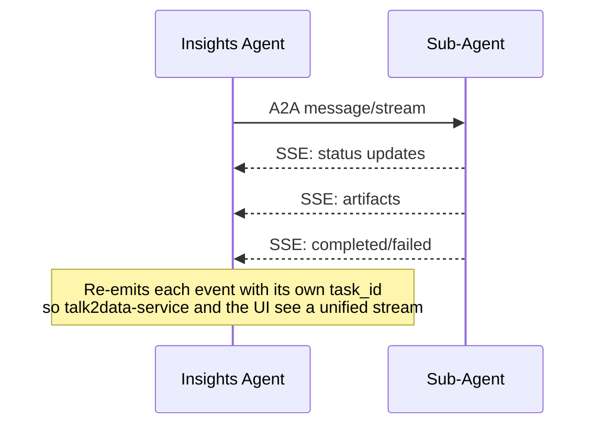
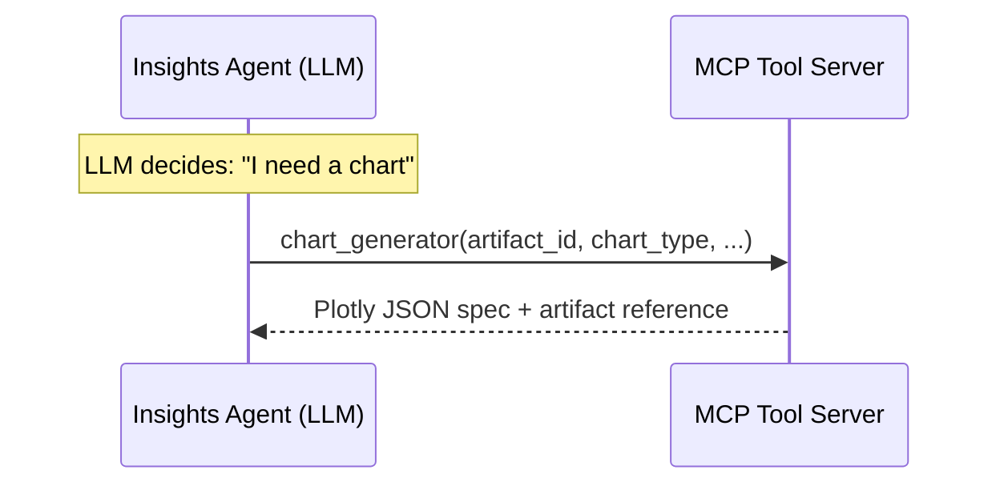
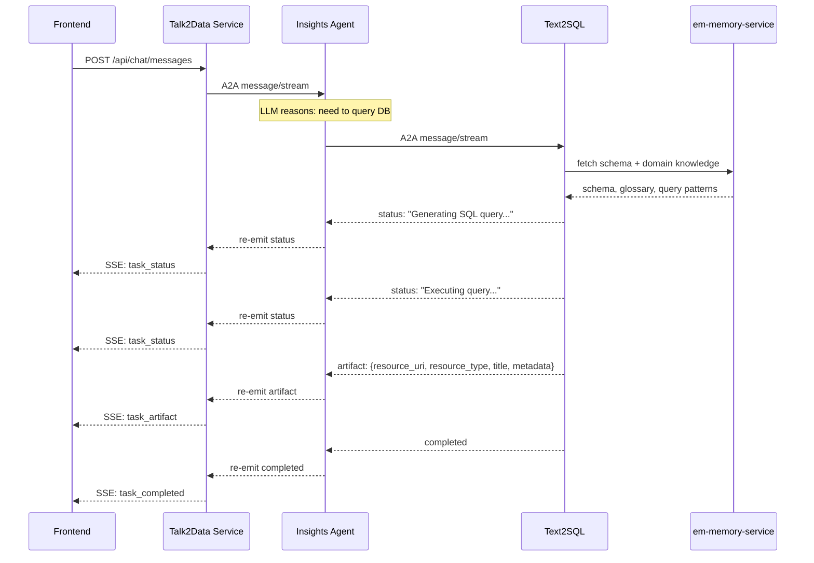
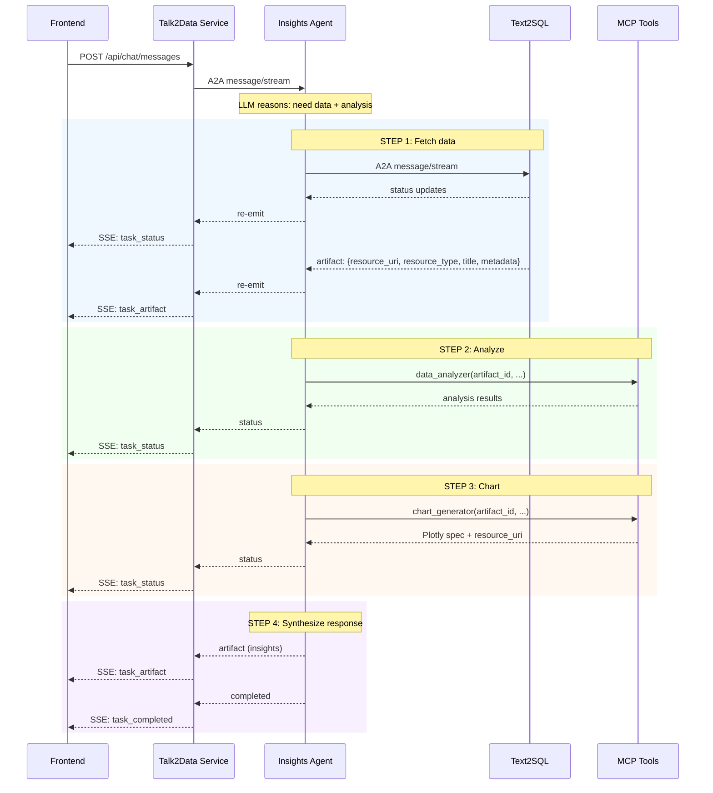
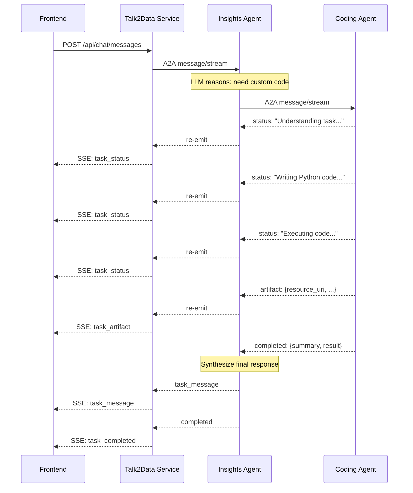
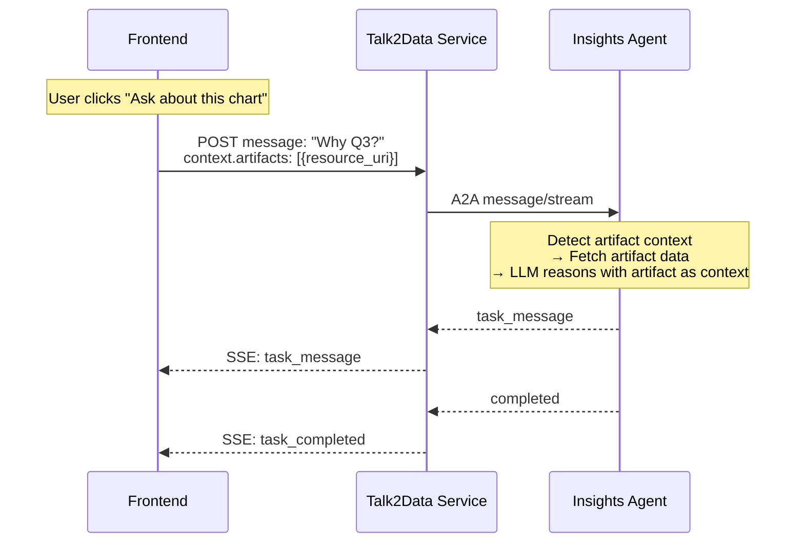

<!--
AUTO-GENERATED from talk2data
Last sync: 2026-06-29 06:53:28 UTC
Source commit: 64e783dd49b85dcad1398ac63be7e39c7c8ca8d8
DO NOT EDIT MANUALLY - Run ./sync_knowledge.sh to update
-->

# talk2data Architecture

## Overview

## Architecture

See [docs/architecture.md](docs/architecture.md) for the full architecture guide, including:

- A2A protocol details and streaming event types
- Agent internals (Text2SQL pipeline, Insights code execution, Orchestrator routing)
- Information flow diagrams for all query types
- API contracts between all components
- Session persistence, artifact storage, and context management
- Design decisions and trade-offs

For the local Kubernetes architecture (networking, port mappings, containerd registry mirroring), see [docs/LOCAL_K8S_ARCHITECTURE.md](docs/LOCAL_K8S_ARCHITECTURE.md).


## Detailed Architecture

# Architecture — Talk2Data

## Overview

Talk2Data is a multi-agent system where users ask natural language questions about data. The **Insights Agent** is the main agent — it runs an agentic loop where the LLM reasons about what to do, takes actions (calling sub-agents or tools), observes results, and continues until the task is complete. Sub-agents (**Text2SQL**, **Coding Agent**) are specialists that stream events back to Insights as they work and return results at the end. Text2SQL leverages **em-memory-service** for database schema and domain knowledge. Component capabilities (**chart generation**, **data analysis**, **schema exploration**) are exposed as MCP tools running in a separate service. All agents use **LiteLLM** as a provider-agnostic LLM gateway. Artifact and asset storage is handled through the **Runtime Artifact Registry** and **Runtime Assets Registry**, accessed via a shared commons module.

---

## Table of Contents

1. [System Architecture](#1-system-architecture)
2. [Insights Agent (Main Agent)](#2-insights-agent-main-agent)
3. [Text2SQL Agent](#3-text2sql-agent)
4. [Coding Agent](#4-coding-agent)
5. [MCP Tool Server](#5-mcp-tool-server)
6. [What is A2A?](#6-what-is-a2a)
7. [LLM Integration using LiteLLM](#7-llm-integration-using-litellm)
8. [Talk2Data Service](#8-talk2data-service)
9. [Artifact & Asset Management](#9-artifact--asset-management)
10. [Authentication & Token Forwarding](#10-authentication--token-forwarding)
11. [Information Flow](#11-information-flow)
12. [Sample Package Structure](#12-sample-package-structure)
13. [Deployment Topology](#13-deployment-topology)
14. [Phased Rollout](#14-phased-rollout)
15. [First Release Scope](#15-first-release-scope)

---

## 1. System Architecture

```
┌─────────────┐    REST+SSE    ┌───────────────────────┐
│  React UI   │◄──────────────►│  Talk2Data Service     │
│  (Vite)     │   :3000/nginx  │  (FastAPI) :8080       │
└─────────────┘                └───────────┬───────────┘
                                           │ A2A JSON-RPC
                                           │ (message/stream)
                                           ▼
                               ┌───────────────────────┐
                               │  Insights Agent :8002  │
                               │  (Main Agent)          │
                               │                        │
                               │  Agentic Loop          │
                               │  Planning & Reasoning  │
                               │  Sub-Agent Coordination│
                               │  Response Synthesis    │
                               └──────┬────────┬───────┘
                                      │        │
                          ┌───── A2A ─┘        └─ MCP ────┐
                          │                               │
              ┌───────────┴───────────┐     ┌─────────────┴─────────────┐
              │    Sub-Agents (A2A)    │     │    MCP Tool Server :8003   │
              │                       │     │                           │
              │  ┌─────────────────┐  │     │  ┌─────────────────────┐  │
              │  │ Text2SQL  :8001 │  │     │  │ chart_generator     │  │
              │  └────────┬────────┘  │     │  │ data_analyzer       │  │
              │           │           │     │  │ schema_explorer     │  │
              │  ┌─────────────────┐  │     │  └─────────────────────┘  │
              │  │ Coding    :8004 │  │     │                           │
              │  └─────────────────┘  │     └───────────────────────────┘
              └───────────────────────┘
                          │
                          ▼
              ┌───────────────────────┐
              │  em-memory-service     │
              │  (schema & domain      │
              │   knowledge)           │
              └───────────────────────┘
```

### Component Summary

| Component | What It Does | Protocol | Port |
|-----------|-------------|----------|------|
| **Talk2Data Service** | FastAPI REST+SSE facade. Accepts user requests from the UI, translates them to A2A, forwards to Insights Agent, translates A2A events back to SSE for the UI. Manages sessions, turns, and feedback. | REST, SSE | 8080 |
| **Insights Agent** | Main agent. Runs an agentic loop — LLM reasons about user queries, calls sub-agents and MCP tools as needed, synthesizes responses. Single entry point for all analysis. | A2A server, A2A client, MCP client | 8002 |
| **Text2SQL Agent** | Sub-agent. Converts natural language to SQL. Fetches schema and domain knowledge from em-memory-service, generates and executes queries, stores results in Runtime Artifact Registry. | A2A server | 8001 |
| **Coding Agent** | Sub-agent. Writes and executes Python code in a sandbox. Loads artifacts as DataFrames, runs computations, stores results. Can iterate on errors. | A2A server | 8004 |
| **MCP Tool Server** | Stateless tool server. Exposes chart_generator (Plotly), data_analyzer (statistics), and schema_explorer (DB metadata) as MCP tools. No LLM reasoning — pure computation. | MCP server (Streamable HTTP) | 8003 |
| **em-memory-service** | External service. Provides database schema and domain knowledge (business glossary, column descriptions, query patterns) to Text2SQL. | API | External |
| **Runtime Artifact Registry** | External registry. Stores computed artifacts — query results (Parquet), charts (Plotly JSON), analysis outputs. All agents read/write via commons client. | API | External |
| **Runtime Assets Registry** | External registry. Stores input data assets — uploaded files, datasource metadata. UI uploads files directly; agents download via commons client. | API | External |
| **PostgreSQL** | Persists sessions, conversation messages, artifact metadata, and feedback. | SQL | 5432 |
| **Redis** | Caches recent conversation context for the Insights Agent's bounded context window. | Redis | 6379 |

---

## 2. Insights Agent (Main Agent)

The Insights Agent is the single entry point for all user queries. It receives requests from the Talk2Data Service via A2A and runs an **agentic loop** — the LLM reasons about the user's request, decides what actions to take, executes them, observes results, and continues looping until the task is complete.

### What It Does

- **Runs an agentic loop** — the LLM reasons step-by-step, deciding what to do next based on the user's request, available tools, and intermediate results. There is no hardcoded intent classification — the LLM decides the approach dynamically.
- **Calls Text2SQL** via A2A when data needs to be fetched from a database
- **Calls Coding Agent** via A2A when custom code needs to be written and executed
- **Calls MCP tools** for charting (Plotly), statistical analysis, and schema exploration
- **Manages conversation context** — maintains a bounded window of recent messages via Redis (with DB fallback)
- **Re-emits sub-agent events** — streams status updates from sub-agents back to the Talk2Data Service with its own task_id
- **Synthesizes responses** — combines results from sub-agents and tools into a coherent answer
- **Handles multi-step tasks naturally** — e.g., "Show me sales trends and explain patterns" → the LLM decides to fetch data (Text2SQL), analyze it (data_analyzer), chart it (chart_generator), and synthesize a narrative, all within a single agentic loop

### Agentic Loop

The Insights Agent does **not** use intent-based classification. Instead, the LLM runs in a loop:

```
1. Receive user message + context (datasources, artifacts, attachments)
2. LLM reasons: what does the user want? what do I need to do?
3. LLM decides next action:
   - Call Text2SQL (A2A) to fetch data
   - Call Coding Agent (A2A) to run code
   - Call an MCP tool (chart_generator, data_analyzer, schema_explorer)
   - Respond directly to the user
4. Execute the action, observe the result
5. If task is not complete → go to step 2
6. If task is complete → synthesize final response and return
```

This allows the agent to handle arbitrarily complex requests — chaining multiple sub-agent calls and tool invocations as needed, adapting its plan based on intermediate results.

### How It Calls Sub-Agents

Both Text2SQL and Coding Agent are called via A2A `message/stream`. They stream events back as they work:



### How It Calls MCP Tools

The Insights Agent is an MCP client. The LLM's native tool-use capability decides which tools to call:



### Agent Card

```json
{
  "name": "Insights Agent",
  "description": "Main analytics agent — plans queries, coordinates sub-agents, analyzes data, generates insights and visualizations",
  "skills": [
    { "id": "data_query", "name": "Data Query", "description": "Query databases using natural language" },
    { "id": "data_analysis", "name": "Data Analysis", "description": "Analyze data, generate charts, and produce insights" },
    { "id": "code_execution", "name": "Code Execution", "description": "Write and execute custom Python code for analysis" }
  ],
  "capabilities": { "streaming": true },
  "url": "http://insights-agent:8002"
}
```

---

## 3. Text2SQL Agent

The Text2SQL Agent converts natural language questions into SQL, executes queries against a database, and stores results in the Runtime Artifact Registry.

### What It Does

- Receives a question + datasource context from the Insights Agent
- Calls **em-memory-service** to fetch the database schema and domain knowledge (e.g., business glossary, column descriptions, query patterns) to write correct SQL queries
- May also inspect the database schema directly to understand available tables and columns
- Generates a SQL query using the LLM
- Validates the SQL (SELECT-only, no destructive operations)
- Executes the query against the target database
- Stores results (as Parquet) in the Runtime Artifact Registry
- Returns the artifact reference (`resource_uri`) along with metadata (columns, row count, SQL used)

### Streaming Behavior

Text2SQL streams events back to the Insights Agent as it progresses:

```
← status: "Fetching schema and domain knowledge..."
← status: "Generating SQL query..."
← status: "Executing query..."
← artifact: {resource_uri: "artifact:query_results_uuid", resource_type: "parquet", title: "...", metadata: {columns, row_count, sql}}
← completed
```

### Input

Receives A2A message with:
- `TextPart` — the user's question
- `DataPart` — datasource metadata (`resource_uri`, `datasource_type`, `datasource_name`, `datasource_description`, `metadata`)
- `contextId` — session ID

### Output

Emits A2A artifact with `FilePart`:

```json
{
  "resource_uri": "artifact:q4_revenue_uuid",
  "resource_type": "parquet",
  "title": "Q4 Revenue by Region",
  "description": "Query results for Q4 revenue broken down by region",
  "metadata": {
    "columns": ["region", "revenue", "quarter"],
    "row_count": 42,
    "sql": "SELECT ..."
  }
}
```

### Persistence

Sub-agents do not persist their own messages. All message and artifact metadata persistence is handled by the Talk2Data Service, which receives A2A events from the Insights Agent and writes them to the database. Agents upload artifacts (e.g., Parquet files, chart specs) to the Runtime Artifact Registry and pass the `resource_uri` back via A2A events.

---

## 4. Coding Agent

The Coding Agent writes and executes Python code in a sandboxed environment. It is a full agent with LLM reasoning — it understands what code to write, executes it, interprets results, and can iterate if needed.

### What It Does

- Receives a task description + optional artifact references from the Insights Agent
- Uses the LLM to generate Python code for the requested computation
- Loads referenced artifacts from the Runtime Artifact Registry as pandas DataFrames
- Executes code in a sandboxed environment with resource limits
- Captures outputs: stdout, return values, generated DataFrames, Plotly figures
- Stores any generated artifacts in the Runtime Artifact Registry
- Returns results (computed values, artifact references, narrative explanation)
- Can iterate: if code fails, the agent reads the error, fixes the code, and retries

### Streaming Behavior

The Coding Agent streams events back to the Insights Agent as it works:

```
← status: "Understanding the task..."
← status: "Writing Python code..."
← status: "Executing code..."
← status: "Code executed successfully, processing results..."
← artifact: {resource_uri: "artifact:results_uuid", resource_type: "parquet", ...}
← completed: {summary: "...", result: ...}
```

If the agent iterates (code error → fix → retry), intermediate status updates are streamed so the user sees progress.

### Input

Receives A2A message with:
- `TextPart` — description of what to compute
- `FilePart` — artifact references to load as DataFrames (with `resource_uri`, `resource_type`, `title`, `description`, `metadata`; optional)
- `contextId` — session ID

### Output

Emits A2A events:
- Status updates as it works
- Artifact events for any generated DataFrames or charts stored in the Runtime Artifact Registry
- Final completion with summary text and results

### Sandbox Environment

- Pre-loaded packages: pandas, numpy, plotly, scipy, scikit-learn
- No network access
- No filesystem access outside temp directory
- Memory and CPU time limits
- Timeout enforcement

### Persistence

The Coding Agent does not persist its own messages. All message and artifact metadata persistence is handled by the Talk2Data Service. The Coding Agent uploads generated artifacts (DataFrames, Plotly charts) to the Runtime Artifact Registry and passes the `resource_uri` back via A2A events.

---

## 5. MCP Tool Server

A single MCP server exposing stateless tools, running as a separate Docker container. These tools perform computations that don't require LLM reasoning — they take structured input and return structured output.

**Transport**: Streamable HTTP (SSE-based)
**Port**: 8003

### 5.1 `chart_generator`

Generates interactive visualizations using **Plotly**. Takes a reference to data in the Runtime Artifact Registry and a chart specification (type, axes, grouping, layout options). Produces a Plotly JSON spec and stores the chart as an artifact in the Runtime Artifact Registry, returning the `resource_uri`. The frontend renders Plotly charts interactively (zoom, pan, hover, export).

### 5.2 `data_analyzer`

Performs statistical analysis on datasets. Takes a reference to data in the Runtime Artifact Registry and an analysis type (summary statistics, correlation, distribution, outlier detection, trend analysis, group comparison). Returns structured analysis results (JSON) with computed metrics and a narrative summary. Pure computation — no side effects.

### 5.3 `schema_explorer`

Inspects database schema metadata. Takes a datasource URI (`data:resource_name`) and explores tables, columns, types, relationships, and sample values. Supports listing tables, describing a specific table, searching columns by name, and sampling values. Read-only — no side effects.

---

## 6. What is A2A?

A2A (Agent-to-Agent) is Google's open protocol for inter-agent communication. It defines how agents discover each other, exchange messages, and stream results — all over standard HTTP using JSON-RPC 2.0.

### Key Concepts

| Concept | Description |
|---------|-------------|
| **Agent Card** | JSON document at `/.well-known/agent-card.json` that describes an agent's capabilities, skills, and endpoint URL. Used for discovery. |
| **Task** | A unit of work. Created when a client sends a message. Has a lifecycle: `submitted` → `working` → `completed` / `failed` / `canceled`. |
| **Message** | A message within a task, containing one or more `Part` objects. Direction is either `user` (client → agent) or `agent` (agent → client). |
| **Part** | The content unit within a message. Types: `TextPart` (plain text), `DataPart` (structured JSON data), `FilePart` (file reference or inline bytes). |
| **Streaming** | `message/stream` method returns an SSE stream of `TaskStatusUpdateEvent` and `TaskArtifactUpdateEvent` as the agent works. |

### How Talk2Data Uses A2A

- **Talk2Data Service → Insights Agent**: sends `message/stream` requests, receives SSE events
- **Insights Agent → Text2SQL / Coding Agent**: sends `message/stream` to sub-agents, re-emits their events upstream
- Each agent exposes an **Agent Card** for discovery
- `contextId` maps to the session ID, enabling multi-turn conversations
- `DataPart` carries datasource metadata; `FilePart` carries artifact and attachment references

### Message Format

```json
{
  "jsonrpc": "2.0",
  "method": "message/stream",
  "params": {
    "message": {
      "role": "user",
      "parts": [
        { "type": "text", "text": "Show me Q4 revenue" },
        { "type": "data", "data": { "resource_uri": "data:production_db", "datasource_type": "database", "datasource_name": "production_db", "datasource_description": "Primary Production DB", "metadata": {} } },
        { "type": "file", "file": { "resource_uri": "artifact:prev_result", "resource_type": "parquet", "title": "Previous Result", "description": null, "metadata": {} } }
      ]
    },
    "contextId": "session-uuid"
  },
  "id": "request-1"
}
```

### SSE Event Types

| Event | Description |
|-------|-------------|
| `TaskStatusUpdateEvent` | Agent status change — includes `state` (working, completed, failed) and optional `message` with progress text |
| `TaskArtifactUpdateEvent` | Agent produced an artifact — includes artifact parts (FilePart with resource_uri) |

---

## 7. LLM Integration using LiteLLM

All agents in Talk2Data use **LiteLLM** as a provider-agnostic LLM gateway. LiteLLM provides a unified interface to call any LLM provider (OpenAI, Anthropic, Azure, Google, AWS Bedrock, local models, etc.) using the OpenAI SDK format — so switching providers requires only a configuration change, not a code change.

### How Agents Use LiteLLM

| Agent | LLM Usage |
|-------|-----------|
| **Insights Agent** | Agentic loop — reasoning, planning, deciding which sub-agents/tools to call, synthesizing responses |
| **Text2SQL Agent** | SQL generation from natural language, using schema and domain knowledge as context |
| **Coding Agent** | Python code generation for data analysis and transformation tasks |

### LiteLLM Configuration

Each agent configures its LLM through LiteLLM's standard parameters:

| Parameter | Description |
|-----------|-------------|
| `model` | Model identifier (e.g., `openai/gpt-4o`, `anthropic/claude-sonnet-4-20250514`, `azure/gpt-4o`) |
| `api_key` | API key for the provider |
| `api_base` | Custom API base URL (for Azure, proxies, or self-hosted models) |
| `temperature` | Sampling temperature |
| `max_tokens` | Maximum response tokens |

### Why LiteLLM

- **Provider agnostic** — same code works with any LLM provider. Swap models by changing config, not code.
- **OpenAI SDK compatible** — uses the familiar `completion()` and `acompletion()` interface. Supports tool/function calling natively.
- **Streaming support** — all agents stream LLM responses for real-time status updates.
- **Fallbacks and retries** — built-in retry logic and provider fallback chains.
- **Cost tracking** — optional spend tracking per request.

### Integration Pattern

```python
from litellm import acompletion

response = await acompletion(
    model=config.model,          # e.g., "anthropic/claude-sonnet-4-20250514"
    messages=messages,           # conversation history + system prompt
    tools=tool_definitions,      # MCP tools or sub-agent capabilities
    stream=True,                 # stream for real-time updates
    temperature=config.temperature,
)
```

Each agent's `config.py` defines its LLM settings. The `commons` package does not enforce a specific model — each agent can use a different model appropriate for its task.

---

## 8. Talk2Data Service

The Talk2Data Service is a FastAPI application that sits between the frontend and the Insights Agent. It is **not** an agent — it is a REST+SSE facade.

### What It Does

- **Accepts REST requests** from the UI at `POST /api/chat/messages`
- **Translates REST → A2A**: builds a JSON-RPC `message/stream` envelope and forwards to the Insights Agent
- **Translates A2A SSE → Simple SSE**: parses A2A events from the Insights Agent and re-emits simplified events to the UI
- **Session CRUD**: create, list, get, rename, delete sessions
- **Turn management**: list turns, get turn by ID, list turn artifacts
- **Feedback**: submit, get, delete feedback on turns
- **Persists user messages and artifacts** to the database during SSE translation (with `turn_id`)
- **Auto-title generation**: generates a session title after the first message (background task)

### Request Format

The UI sends a REST request to `POST /api/chat/messages`:

```json
{
  "session_id": "uuid-or-null",
  "message": "Show me Q4 revenue by region",
  "context": {
    "datasources": [
      {
        "resource_uri": "data:production_db",
        "datasource_type": "database",
        "datasource_name": "production_db",
        "datasource_description": "Primary Production DB",
        "metadata": {}
      }
    ],
    "artifacts": [
      {
        "resource_uri": "artifact:q4_revenue_uuid",
        "resource_type": "parquet",
        "title": "Q4 Revenue by Region",
        "description": "Q4 revenue figures broken down by region",
        "metadata": {"columns": ["region", "revenue", "quarter"], "row_count": 42}
      }
    ],
    "attachments": [
      {
        "resource_uri": "asset:sales_data_uuid",
        "resource_type": "csv",
        "title": "sales_data.csv",
        "description": "Historical sales data",
        "metadata": {"filename": "sales_data.csv", "content_type": "text/csv", "size_bytes": 245000}
      }
    ]
  }
}
```

- **`datasources`**: Databases/datasources the user has selected. Translated to `DataPart` per datasource (with `resource_uri`, `datasource_type`, `datasource_name`, `datasource_description`, `metadata`). Passed to agents so they know which database to query.
- **`artifacts`**: Previously generated artifacts the user is referencing for follow-up questions. Translated to `FilePart` per artifact (with `resource_uri`, `resource_type`, `title`, `description`, `metadata`). Agents fetch the data via `resource_uri`.
- **`attachments`**: Files uploaded to the Runtime Assets Registry (via `POST api/assets/files`). Translated to `FilePart` per attachment (with `resource_uri`, `resource_type`, `title`, `description`, `metadata`). Agents download them from the Assets Registry.

**`DataPart` fields for datasources:**

| Field | Type | Description |
|-------|------|-------------|
| `resource_uri` | string | URI identifying the datasource (`data:resource_name`) |
| `datasource_type` | string | Type of datasource (e.g., `database`) |
| `datasource_name` | string | Name of the datasource |
| `datasource_description` | string \| null | Human-readable description |
| `metadata` | dict | Additional metadata |

**`FilePart` fields for artifacts and attachments:**

| Field | Type | Description |
|-------|------|-------------|
| `resource_uri` | string | URI identifying the resource (`artifact:name` or `asset:name`) |
| `resource_type` | string | Type of resource (e.g., `parquet`, `chart`, `csv`, `xlsx`) |
| `title` | string | Display title |
| `description` | string \| null | Human-readable description |
| `metadata` | dict | Additional metadata (columns, row_count, content_type, etc.) |

### SSE Events Emitted to UI

| Event | When |
|-------|------|
| `session_created` | New session was created (when `session_id` was null) |
| `title_updated` | Auto-generated title is ready |
| `task_status` | Agent is working — includes `agent` name and progress `message` |
| `task_artifact` | Agent produced an artifact — includes `resource_uri`, `resource_type`, `title`, `metadata` |
| `task_message` | Agent produced a text response |
| `task_completed` | Task finished successfully |
| `task_failed` | Task failed — includes `error_code` and `error_message` |
| `task_canceled` | Task was canceled |

All events include `turn_id` so the UI can group user message + agent responses. See `api-endpoints.md` and `rest-sse-facade.md` for full event schemas.

### How Context Flows

```
UI sends context:
  datasources[] ──► Talk2Data Service builds DataPart per datasource  (resource_uri, datasource_type, datasource_name, datasource_description, metadata) ──► A2A message
  artifacts[]   ──► Talk2Data Service builds FilePart per artifact  (resource_uri, resource_type, title, description, metadata) ──► A2A message
  attachments[] ──► Talk2Data Service builds FilePart per attachment (resource_uri, resource_type, title, description, metadata) ──► A2A message

Insights Agent receives these parts and:
  - Passes datasource DataParts to Text2SQL or schema_explorer as needed
  - Fetches artifact data from Runtime Artifact Registry using resource_uri from FilePart
  - Downloads attachments from Runtime Assets Registry using resource_uri from FilePart
```

---

## 9. Artifact & Asset Management

Artifact and asset management is handled by a shared module in the `commons` package — **not** an MCP tool. All agents and services that need to read/write artifacts or assets use this module.

### Runtime Artifact Registry

Stores computed artifacts — query results, analysis outputs, chart specs.

| Operation | Description |
|-----------|-------------|
| **Store** | Save data (Parquet, chart JSON, etc.) and receive a `resource_uri` (`artifact:resource_name`) |
| **Retrieve** | Fetch artifact data by `resource_uri` |
| **List** | List artifacts for a session |
| **Preview** | Fetch first N rows of a data artifact |

**Who writes:**
- Text2SQL Agent — stores query results as Parquet
- Coding Agent — stores generated DataFrames and Plotly figures
- MCP `chart_generator` tool — stores chart artifacts

**Who reads:**
- Insights Agent — fetches artifacts for analysis
- Coding Agent — loads artifacts as DataFrames
- MCP tools — load data for analysis/charting
- Talk2Data Service — serves artifact metadata to the UI
- UI — downloads artifact data directly using `api/assets/artifacts/download`. No endpoints in talk2data

### Runtime Assets Registry

Stores input data assets — uploaded files, datasource metadata.

| Operation | Description |
|-----------|-------------|
| **Upload** | UI uploads files via `POST api/assets/files`, receives `resource_uri` (`asset:resource_name`) |
| **Retrieve** | Agents download file content by `resource_uri` |
| **List datasources** | List available datasources for a project (`data:resource_name`) |

### Commons Module

The `commons` package provides a shared client for both registries:

```python
# commons/artifacts_client.py
class ArtifactRegistryClient:
    async def store(self, data, artifact_type, metadata, jwt_token, project_id) -> str:  # returns resource_uri
    async def retrieve(self, resource_uri, jwt_token, project_id) -> bytes:
    async def list(self, session_id, jwt_token, project_id) -> list:
    async def preview(self, resource_uri, jwt_token, project_id, limit=10) -> dict:

# commons/assets_client.py
class AssetsRegistryClient:
    async def get_asset(self, resource_uri, jwt_token, project_id) -> bytes:
    async def list_datasources(self, jwt_token, project_id) -> list:
```

All registry calls include the JWT token and project ID for authentication and scoping (see [Section 10](#10-authentication--token-forwarding)).

### Resource URI Scheme

All artifacts and assets are referenced by `resource_uri` throughout the system:

| URI Pattern | What | Examples |
|-------------|------|----------|
| `data:resource_name` | Database or datasource | `data:production_db`, `data:analytics_warehouse` |
| `asset:resource_name` | Uploaded file or data asset | `asset:sales_data_csv`, `asset:reference_dataset` |
| `artifact:resource_name` | Computed artifact (query results, charts, analysis) | `artifact:q4_revenue`, `artifact:trend_chart` |

---

## 10. Authentication & Token Forwarding

The JWT token is provided by the UI in the `Authorization: Bearer <JWT>` header along with `X-Project-ID`. The Talk2Data Service does **not** verify the JWT — it extracts the `user_id` from the `sub` claim and passes the token through.

### Token Flow

```
UI
 │ Authorization: Bearer <JWT>
 │ X-Project-ID: <project-id>
 ▼
Talk2Data Service
 │ Extracts user_id from JWT sub claim (no verification)
 │ Forwards JWT + X-Project-ID to Insights Agent
 ▼
Insights Agent
 │ Forwards JWT + X-Project-ID to:
 ├──► Text2SQL Agent (via A2A headers)
 │       └──► Runtime Artifact Registry (via API calls, JWT + project_id)
 │       └──► em-memory-service (via API calls, JWT + project_id)
 ├──► Coding Agent (via A2A headers)
 │       └──► Runtime Artifact Registry (via API calls, JWT + project_id)
 ├──► MCP Tool Server (via MCP request headers)
 │       └──► Runtime Artifact Registry (via API calls, JWT + project_id)
 └──► Runtime Artifact Registry (via API calls, JWT + project_id)
      Runtime Assets Registry (via API calls, JWT + project_id)
```

Every call to the Runtime Artifact Registry and Runtime Assets Registry includes the JWT token and project ID so the registries can authorize access and scope data correctly. Both propagate from the UI all the way through to the registries without modification.

---

## 11. Information Flow

### 11.1 Data Query ("Show me top 10 customers")



### 11.2 Data + Insights ("Show me sales trends and explain patterns")



### 11.3 Code Execution ("Calculate moving average and forecast next quarter")



### 11.4 Artifact Follow-Up ("Ask about this chart")



---

## 12. Sample Package Structure

```
packages/
├── common-db/                        # Shared DB models, stores, migrations
│   ├── src/common_db/
│   │   ├── models.py                # SQLAlchemy models (Session, ConversationMessage, Artifact, TurnFeedback)
│   │   ├── session_store.py         # Session & message persistence
│   │   ├── artifact_store.py        # Artifact metadata persistence
│   │   ├── manager.py               # DB manager
│   │   ├── migrations.py            # Alembic migration runner
│   │   └── alembic/                 # Migration scripts
│   └── pyproject.toml
│
├── commons/                          # Shared utilities, LLM, logging, auth
│   ├── src/commons/
│   │   ├── llm.py                   # LiteLLM client wrapper
│   │   ├── logging_config.py        # Logging setup
│   │   ├── service_auth.py          # ServiceAuthClient (Keycloak)
│   │   ├── db/
│   │   │   └── engine.py            # SQLAlchemy async engine factory
│   │   ├── config.py
│   │   └── schemas.py               # Shared Pydantic models
│   └── pyproject.toml
│
├── talk2data-service/                # REST+SSE facade
│   ├── src/talk2data_service/
│   │   ├── app.py
│   │   ├── auth.py
│   │   ├── config.py
│   │   ├── sse_translator.py        # A2A SSE → Simple SSE translation
│   │   └── routes/
│   │       ├── messages.py          # POST /api/chat/messages
│   │       └── sessions.py          # Session, turn, artifact, feedback endpoints
│   └── pyproject.toml
│
├── insights/                         # Main agent
│   ├── src/insights/
│   │   ├── server.py
│   │   ├── executor.py              # Agentic loop, planning, coordination, analysis
│   │   ├── config.py
│   │   └── mcp_client.py            # MCP client for tool server
│   └── pyproject.toml
│
├── text2sql/                         # Sub-agent
│   ├── src/text2sql/
│   │   ├── server.py
│   │   ├── executor.py
│   │   └── config.py
│   └── pyproject.toml
│
├── coding/                           # Sub-agent (NEW)
│   ├── src/coding/
│   │   ├── server.py
│   │   ├── executor.py
│   │   └── config.py
│   ├── Dockerfile
│   └── pyproject.toml
│
└── tools/                            # MCP tool server (NEW)
    ├── src/tools/
    │   ├── server.py                 # FastMCP app, Streamable HTTP
    │   ├── chart_generator.py        # Plotly chart generation
    │   ├── data_analyzer.py          # Statistical analysis
    │   ├── schema_explorer.py        # Database schema introspection
    │   └── config.py
    ├── Dockerfile
    └── pyproject.toml
```

### Dependency Graph

```
common-db ◄──── talk2data-service
   ▲
   ├──── insights (conversation context queries)
   │
commons ◄──── talk2data-service
   ▲
   ├──── insights
   ├──── text2sql
   ├──── coding
   └──── tools
```

---

## 13. Deployment Topology

### Docker Compose Services

| Service | Port (To be Updated) | Connects To |
|---------|------|-------------|
| `postgres` | 5432 | — |
| `redis` | 6379 | — |
| `text2sql-agent` | 8001 | postgres, em-memory-service, Runtime Artifact Registry |
| `insights-agent` | 8002 | postgres, redis, text2sql-agent, coding-agent, mcp-tools, Runtime Artifact Registry, Runtime Assets Registry |
| `mcp-tools` | 8003 | Runtime Artifact Registry, Runtime Assets Registry |
| `coding-agent` | 8004 | Runtime Artifact Registry |
| `talk2data-service` | 8080 | postgres, insights-agent |
| `frontend` | 3000 (nginx) | talk2data-service |

---

## 14. Phased Rollout

### Phase 1 — Core Architecture

Build the foundational system with A2A communication between all agents.

| Task | Description |
|------|-------------|
| **Insights Agent as main agent** | Implement agentic loop, planning, reasoning, context management, sub-agent coordination. Receives requests from Talk2Data Service via A2A. LLM decides actions dynamically — no hardcoded intent classification. |
| **Text2SQL Agent via A2A** | Insights calls Text2SQL via A2A `message/stream`. Text2SQL streams status events back and returns artifact reference on completion. |
| **Coding Agent via A2A** | New agent. Insights calls it via A2A `message/stream`. Writes and executes Python code in sandbox, streams events, returns results. |
| **MCP Tool Server** | New package. Exposes `chart_generator`, `data_analyzer`, `schema_explorer` as MCP tools. Insights Agent is an MCP client that calls these tools. |
| **Artifact & Assets commons module** | `ArtifactRegistryClient` and `AssetsRegistryClient` in commons. All agents use these to read/write from Runtime Registries. JWT token and project ID forwarded on every call. |
| **Talk2Data Service → Insights** | Talk2Data Service sends A2A requests to Insights Agent. REST+SSE facade behavior unchanged. |
| **SSE translation** | Talk2Data Service translates A2A events from Insights Agent into simplified SSE events for the UI. Handles re-emitted sub-agent events seamlessly. |

### Phase 2 — Dual Protocol (A2A + MCP)

Add MCP server endpoints to agents so external LLM hosts can call them directly.

| Task | Description |
|------|-------------|
| **Text2SQL MCP endpoint** | Text2SQL exposes an MCP tool (`query`) alongside its A2A endpoint. Same port, dual protocol. External MCP clients can query databases directly. |
| **Insights MCP endpoint** | Insights exposes an MCP tool (`analyze`) alongside its A2A endpoint. External MCP clients get full planning + analysis capabilities. |
| **Coding Agent MCP endpoint** | Coding Agent exposes an MCP tool (`execute`) alongside its A2A endpoint. External MCP clients can run code directly. |
| **Shared MCP plumbing in commons** | MCP-to-EventQueue adapter, JWT auth middleware for MCP, factory for creating MCP ASGI apps from executors. |

**Phase 2 Architecture:**

```
Claude Desktop / Cursor / Claude Code
   │                │                │
   │ MCP            │ MCP            │ MCP
   ▼                ▼                ▼
┌──────────┐  ┌──────────┐  ┌──────────┐
│ Insights │  │ Text2SQL │  │ Coding   │
│ MCP+A2A  │  │ MCP+A2A  │  │ MCP+A2A  │
│ :8002    │  │ :8001    │  │ :8004    │
└──────────┘  └──────────┘  └──────────┘
```

Each agent serves both protocols on a single port:

```
Agent (single port)
├── POST /                            ← A2A (JSON-RPC 2.0)
├── GET  /.well-known/agent-card.json ← A2A discovery
└── /mcp/                             ← MCP (Streamable HTTP)
```

### Phase 3 — User-Provided Claude Skills

Allow users to upload and register their own Claude Skills, which the Insights Agent can invoke during analysis. This makes the system extensible — users bring domain-specific analysis, data transformation, and insights capabilities without modifying the core agents.

#### What Are User-Provided Skills?

Skills are self-contained analysis or transformation capabilities that users upload to the platform. Examples:

| Skill Example | What It Does |
|---------------|--------------|
| **Revenue Forecasting** | Takes historical revenue data, applies domain-specific forecasting model, returns projections |
| **Churn Risk Scoring** | Scores customer records for churn probability using a proprietary algorithm |
| **Data Normalization** | Applies company-specific data cleaning and normalization rules |
| **Compliance Check** | Validates data against regulatory rules and flags violations |
| **Custom KPI Calculator** | Computes domain-specific KPIs (LTV, CAC, NRR, etc.) from raw data |

Skills are not general-purpose agents — they are focused, single-purpose analysis or transformation instructions / functions that encode domain knowledge the LLM doesn't have.

#### How Skills Are Used

Only the **Insights Agent** invokes user-provided skills. The flow:

```
User uploads skill ──► Skill Registry (stores skill definition + code)

Later, during analysis:

Insights Agent
  │ LLM reasons: "This needs the Revenue Forecasting skill"
  │
  │ Discovers available skills for this project
  │ Matches skill to task
  │
  │ Invokes skill with:
  │   - Input artifact (data to process)
  │   - Skill parameters
  │   - JWT token
  │
  ◄── Skill returns:
       - Output artifact (processed data, stored in Artifact Registry)
       - Result summary
       - Any generated charts or tables
```

#### Skill Lifecycle

| Step | Description |
|------|-------------|
| **Upload** | User uploads a skill definition (name, description, input/output schema, code/configuration) via the UI |
| **Register** | Skill is stored in a Skill Registry, scoped to the user's project |
| **Discover** | When the Insights Agent handles a request, it queries the Skill Registry for skills available in the current project |
| **Match** | The LLM decides whether an available skill is relevant to the current task based on the skill's description and the user's query |
| **Invoke** | Insights Agent calls the skill, passing input data (artifact reference) and parameters |
| **Return** | Skill executes, stores output in the Runtime Artifact Registry, and returns results to the Insights Agent |

#### Integration with Insights Agent

The Insights Agent treats user-provided skills as additional tools alongside MCP tools and sub-agents:

```
Insights Agent has access to:
  ├── Sub-Agents (A2A)
  │   ├── Text2SQL — data fetching
  │   └── Coding Agent — custom code execution
  │
  ├── MCP Tools
  │   ├── chart_generator — Plotly visualizations
  │   ├── data_analyzer — statistical analysis
  │   └── schema_explorer — database schema
  │
  └── User-Provided Skills (Phase 3)
      ├── Revenue Forecasting (user-uploaded)
      ├── Churn Risk Scoring (user-uploaded)
      └── ... (project-specific)
```

The LLM's system prompt is augmented with descriptions of available skills for the current project, so it can decide when to invoke them.

| Task | Description |
|------|-------------|
| **Skill Registry** | Storage and management of user-uploaded skill definitions, scoped to projects. CRUD operations for skills. |
| **Skill discovery API** | Insights Agent queries available skills for the current project at the start of each request. |
| **Skill invocation** | Insights Agent invokes skills by passing input artifacts and parameters. Skills run in an isolated environment. |
| **Skill definition format** | Define the schema for skill definitions — name, description, input/output schema, execution code, required packages. |
| **UI for skill management** | Upload, list, edit, delete skills. Test a skill with sample data. |
| **Skill sandboxing** | Skills execute in an isolated environment with access only to input data and approved packages. |

---

## 15. First Release Scope

**Target: March 27th, 2026 — Dev deployment**

### In Scope

| Feature | Description |
|---------|-------------|
| **Chat history** | Users can view and navigate their past conversations |
| **Interactive charts and graphs** | Plotly-based interactive visualizations (zoom, pan, hover, export) |
| **Artifact download** | Users can download artifacts (query results, charts, etc.) |
| **Start new chat** | Users can start a new conversation at any time |
| **Chat feedback** | Thumbs up/down + qualitative text feedback per turn. Collected and stored but **not used for model improvement** in this release. |
| **Artifacts per conversation** | Each conversation lists its set of generated artifacts (tables, charts, analysis outputs) |
| **Talk to intermediate artifacts** | Users can ask follow-up questions about any intermediate artifact (chart, table, query, etc.) that is part of a response within a turn in a multi-turn conversation |
| **Rename chat** | Users can manually rename a conversation |
| **Delete chat** | Users can delete a conversation and its associated data |
| **Auto-assign chat name** | System automatically generates a title for new conversations based on the first message |

### Optional / Nice to Have

| Feature | Description |
|---------|-------------|
| **Search on chat history** | Search across conversation titles via ILIKE |
| **File upload** | Files are persisted in the Runtime Assets Registry and **not limited to sessions** (available across conversations). Limit: **5 files total** per user, user can select **up to 2** per message. File size limit: **5 MB per file**. |

### Deployment Scope

| Item | Description |
|------|-------------|
| **Helm chart** | Kubernetes deployment via Helm chart, packaged for deployment with Runtime and DR (Data Readiness) |

---

## Detailed Architecture

# Architecture — Talk2Data

## Overview

Talk2Data is a multi-agent system where users ask natural language questions about data. The **Insights Agent** is the main agent — it runs an agentic loop where the LLM reasons about what to do, takes actions (calling sub-agents or tools), observes results, and continues until the task is complete. Sub-agents (**Text2SQL**, **Coding Agent**) are specialists that stream events back to Insights as they work and return results at the end. Text2SQL leverages **em-memory-service** for database schema and domain knowledge. Component capabilities (**chart generation**, **data analysis**, **schema exploration**) are exposed as MCP tools running in a separate service. All agents use **LiteLLM** as a provider-agnostic LLM gateway. Artifact and asset storage is handled through the **Runtime Artifact Registry** and **Runtime Assets Registry**, accessed via a shared commons module.

---

## Table of Contents

1. [System Architecture](#1-system-architecture)
2. [Insights Agent (Main Agent)](#2-insights-agent-main-agent)
3. [Text2SQL Agent](#3-text2sql-agent)
4. [Coding Agent](#4-coding-agent)
5. [MCP Tool Server](#5-mcp-tool-server)
6. [What is A2A?](#6-what-is-a2a)
7. [LLM Integration using LiteLLM](#7-llm-integration-using-litellm)
8. [Talk2Data Service](#8-talk2data-service)
9. [Artifact & Asset Management](#9-artifact--asset-management)
10. [Authentication & Token Forwarding](#10-authentication--token-forwarding)
11. [Information Flow](#11-information-flow)
12. [Sample Package Structure](#12-sample-package-structure)
13. [Deployment Topology](#13-deployment-topology)
14. [Phased Rollout](#14-phased-rollout)
15. [First Release Scope](#15-first-release-scope)

---

## 1. System Architecture

```
┌─────────────┐    REST+SSE    ┌───────────────────────┐
│  React UI   │◄──────────────►│  Talk2Data Service     │
│  (Vite)     │   :3000/nginx  │  (FastAPI) :8080       │
└─────────────┘                └───────────┬───────────┘
                                           │ A2A JSON-RPC
                                           │ (message/stream)
                                           ▼
                               ┌───────────────────────┐
                               │  Insights Agent :8002  │
                               │  (Main Agent)          │
                               │                        │
                               │  Agentic Loop          │
                               │  Planning & Reasoning  │
                               │  Sub-Agent Coordination│
                               │  Response Synthesis    │
                               └──────┬────────┬───────┘
                                      │        │
                          ┌───── A2A ─┘        └─ MCP ────┐
                          │                               │
              ┌───────────┴───────────┐     ┌─────────────┴─────────────┐
              │    Sub-Agents (A2A)    │     │    MCP Tool Server :8003   │
              │                       │     │                           │
              │  ┌─────────────────┐  │     │  ┌─────────────────────┐  │
              │  │ Text2SQL  :8001 │  │     │  │ chart_generator     │  │
              │  └────────┬────────┘  │     │  │ data_analyzer       │  │
              │           │           │     │  │ schema_explorer     │  │
              │  ┌─────────────────┐  │     │  └─────────────────────┘  │
              │  │ Coding    :8004 │  │     │                           │
              │  └─────────────────┘  │     └───────────────────────────┘
              └───────────────────────┘
                          │
                          ▼
              ┌───────────────────────┐
              │  em-memory-service     │
              │  (schema & domain      │
              │   knowledge)           │
              └───────────────────────┘
```

### Component Summary

| Component | What It Does | Protocol | Port |
|-----------|-------------|----------|------|
| **Talk2Data Service** | FastAPI REST+SSE facade. Accepts user requests from the UI, translates them to A2A, forwards to Insights Agent, translates A2A events back to SSE for the UI. Manages sessions, turns, and feedback. | REST, SSE | 8080 |
| **Insights Agent** | Main agent. Runs an agentic loop — LLM reasons about user queries, calls sub-agents and MCP tools as needed, synthesizes responses. Single entry point for all analysis. | A2A server, A2A client, MCP client | 8002 |
| **Text2SQL Agent** | Sub-agent. Converts natural language to SQL. Fetches schema and domain knowledge from em-memory-service, generates and executes queries, stores results in Runtime Artifact Registry. | A2A server | 8001 |
| **Coding Agent** | Sub-agent. Writes and executes Python code in a sandbox. Loads artifacts as DataFrames, runs computations, stores results. Can iterate on errors. | A2A server | 8004 |
| **MCP Tool Server** | Stateless tool server. Exposes chart_generator (Plotly), data_analyzer (statistics), and schema_explorer (DB metadata) as MCP tools. No LLM reasoning — pure computation. | MCP server (Streamable HTTP) | 8003 |
| **em-memory-service** | External service. Provides database schema and domain knowledge (business glossary, column descriptions, query patterns) to Text2SQL. | API | External |
| **Runtime Artifact Registry** | External registry. Stores computed artifacts — query results (Parquet), charts (Plotly JSON), analysis outputs. All agents read/write via commons client. | API | External |
| **Runtime Assets Registry** | External registry. Stores input data assets — uploaded files, datasource metadata. UI uploads files directly; agents download via commons client. | API | External |
| **PostgreSQL** | Persists sessions, conversation messages, artifact metadata, and feedback. | SQL | 5432 |
| **Redis** | Caches recent conversation context for the Insights Agent's bounded context window. | Redis | 6379 |

---

## 2. Insights Agent (Main Agent)

The Insights Agent is the single entry point for all user queries. It receives requests from the Talk2Data Service via A2A and runs an **agentic loop** — the LLM reasons about the user's request, decides what actions to take, executes them, observes results, and continues looping until the task is complete.

### What It Does

- **Runs an agentic loop** — the LLM reasons step-by-step, deciding what to do next based on the user's request, available tools, and intermediate results. There is no hardcoded intent classification — the LLM decides the approach dynamically.
- **Calls Text2SQL** via A2A when data needs to be fetched from a database
- **Calls Coding Agent** via A2A when custom code needs to be written and executed
- **Calls MCP tools** for charting (Plotly), statistical analysis, and schema exploration
- **Manages conversation context** — maintains a bounded window of recent messages via Redis (with DB fallback)
- **Re-emits sub-agent events** — streams status updates from sub-agents back to the Talk2Data Service with its own task_id
- **Synthesizes responses** — combines results from sub-agents and tools into a coherent answer
- **Handles multi-step tasks naturally** — e.g., "Show me sales trends and explain patterns" → the LLM decides to fetch data (Text2SQL), analyze it (data_analyzer), chart it (chart_generator), and synthesize a narrative, all within a single agentic loop

### Agentic Loop

The Insights Agent does **not** use intent-based classification. Instead, the LLM runs in a loop:

```
1. Receive user message + context (datasources, artifacts, attachments)
2. LLM reasons: what does the user want? what do I need to do?
3. LLM decides next action:
   - Call Text2SQL (A2A) to fetch data
   - Call Coding Agent (A2A) to run code
   - Call an MCP tool (chart_generator, data_analyzer, schema_explorer)
   - Respond directly to the user
4. Execute the action, observe the result
5. If task is not complete → go to step 2
6. If task is complete → synthesize final response and return
```

This allows the agent to handle arbitrarily complex requests — chaining multiple sub-agent calls and tool invocations as needed, adapting its plan based on intermediate results.

### How It Calls Sub-Agents

Both Text2SQL and Coding Agent are called via A2A `message/stream`. They stream events back as they work:


### How It Calls MCP Tools

The Insights Agent is an MCP client. The LLM's native tool-use capability decides which tools to call:


### Agent Card

```json
{
  "name": "Insights Agent",
  "description": "Main analytics agent — plans queries, coordinates sub-agents, analyzes data, generates insights and visualizations",
  "skills": [
    { "id": "data_query", "name": "Data Query", "description": "Query databases using natural language" },
    { "id": "data_analysis", "name": "Data Analysis", "description": "Analyze data, generate charts, and produce insights" },
    { "id": "code_execution", "name": "Code Execution", "description": "Write and execute custom Python code for analysis" }
  ],
  "capabilities": { "streaming": true },
  "url": "http://insights-agent:8002"
}
```

---

## 3. Text2SQL Agent

The Text2SQL Agent converts natural language questions into SQL, executes queries against a database, and stores results in the Runtime Artifact Registry.

### What It Does

- Receives a question + datasource context from the Insights Agent
- Calls **em-memory-service** to fetch the database schema and domain knowledge (e.g., business glossary, column descriptions, query patterns) to write correct SQL queries
- May also inspect the database schema directly to understand available tables and columns
- Generates a SQL query using the LLM
- Validates the SQL (SELECT-only, no destructive operations)
- Executes the query against the target database
- Stores results (as Parquet) in the Runtime Artifact Registry
- Returns the artifact reference (`resource_uri`) along with metadata (columns, row count, SQL used)

### Streaming Behavior

Text2SQL streams events back to the Insights Agent as it progresses:

```
← status: "Fetching schema and domain knowledge..."
← status: "Generating SQL query..."
← status: "Executing query..."
← artifact: {resource_uri: "artifact:query_results_uuid", resource_type: "parquet", title: "...", metadata: {columns, row_count, sql}}
← completed
```

### Input

Receives A2A message with:
- `TextPart` — the user's question
- `DataPart` — datasource metadata (`resource_uri`, `datasource_type`, `datasource_name`, `datasource_description`, `metadata`)
- `contextId` — session ID

### Output

Emits A2A artifact with `FilePart`:

```json
{
  "resource_uri": "artifact:q4_revenue_uuid",
  "resource_type": "parquet",
  "title": "Q4 Revenue by Region",
  "description": "Query results for Q4 revenue broken down by region",
  "metadata": {
    "columns": ["region", "revenue", "quarter"],
    "row_count": 42,
    "sql": "SELECT ..."
  }
}
```

### Persistence

Sub-agents do not persist their own messages. All message and artifact metadata persistence is handled by the Talk2Data Service, which receives A2A events from the Insights Agent and writes them to the database. Agents upload artifacts (e.g., Parquet files, chart specs) to the Runtime Artifact Registry and pass the `resource_uri` back via A2A events.

---

## 4. Coding Agent

The Coding Agent writes and executes Python code in a sandboxed environment. It is a full agent with LLM reasoning — it understands what code to write, executes it, interprets results, and can iterate if needed.

### What It Does

- Receives a task description + optional artifact references from the Insights Agent
- Uses the LLM to generate Python code for the requested computation
- Loads referenced artifacts from the Runtime Artifact Registry as pandas DataFrames
- Executes code in a sandboxed environment with resource limits
- Captures outputs: stdout, return values, generated DataFrames, Plotly figures
- Stores any generated artifacts in the Runtime Artifact Registry
- Returns results (computed values, artifact references, narrative explanation)
- Can iterate: if code fails, the agent reads the error, fixes the code, and retries

### Streaming Behavior

The Coding Agent streams events back to the Insights Agent as it works:

```
← status: "Understanding the task..."
← status: "Writing Python code..."
← status: "Executing code..."
← status: "Code executed successfully, processing results..."
← artifact: {resource_uri: "artifact:results_uuid", resource_type: "parquet", ...}
← completed: {summary: "...", result: ...}
```

If the agent iterates (code error → fix → retry), intermediate status updates are streamed so the user sees progress.

### Input

Receives A2A message with:
- `TextPart` — description of what to compute
- `FilePart` — artifact references to load as DataFrames (with `resource_uri`, `resource_type`, `title`, `description`, `metadata`; optional)
- `contextId` — session ID

### Output

Emits A2A events:
- Status updates as it works
- Artifact events for any generated DataFrames or charts stored in the Runtime Artifact Registry
- Final completion with summary text and results

### Sandbox Environment

- Pre-loaded packages: pandas, numpy, plotly, scipy, scikit-learn
- No network access
- No filesystem access outside temp directory
- Memory and CPU time limits
- Timeout enforcement

### Persistence

The Coding Agent does not persist its own messages. All message and artifact metadata persistence is handled by the Talk2Data Service. The Coding Agent uploads generated artifacts (DataFrames, Plotly charts) to the Runtime Artifact Registry and passes the `resource_uri` back via A2A events.

---

## 5. MCP Tool Server

A single MCP server exposing stateless tools, running as a separate Docker container. These tools perform computations that don't require LLM reasoning — they take structured input and return structured output.

**Transport**: Streamable HTTP (SSE-based)
**Port**: 8003

### 5.1 `chart_generator`

Generates interactive visualizations using **Plotly**. Takes a reference to data in the Runtime Artifact Registry and a chart specification (type, axes, grouping, layout options). Produces a Plotly JSON spec and stores the chart as an artifact in the Runtime Artifact Registry, returning the `resource_uri`. The frontend renders Plotly charts interactively (zoom, pan, hover, export).

### 5.2 `data_analyzer`

Performs statistical analysis on datasets. Takes a reference to data in the Runtime Artifact Registry and an analysis type (summary statistics, correlation, distribution, outlier detection, trend analysis, group comparison). Returns structured analysis results (JSON) with computed metrics and a narrative summary. Pure computation — no side effects.

### 5.3 `schema_explorer`

Inspects database schema metadata. Takes a datasource URI (`data:resource_name`) and explores tables, columns, types, relationships, and sample values. Supports listing tables, describing a specific table, searching columns by name, and sampling values. Read-only — no side effects.

---

## 6. What is A2A?

A2A (Agent-to-Agent) is Google's open protocol for inter-agent communication. It defines how agents discover each other, exchange messages, and stream results — all over standard HTTP using JSON-RPC 2.0.

### Key Concepts

| Concept | Description |
|---------|-------------|
| **Agent Card** | JSON document at `/.well-known/agent-card.json` that describes an agent's capabilities, skills, and endpoint URL. Used for discovery. |
| **Task** | A unit of work. Created when a client sends a message. Has a lifecycle: `submitted` → `working` → `completed` / `failed` / `canceled`. |
| **Message** | A message within a task, containing one or more `Part` objects. Direction is either `user` (client → agent) or `agent` (agent → client). |
| **Part** | The content unit within a message. Types: `TextPart` (plain text), `DataPart` (structured JSON data), `FilePart` (file reference or inline bytes). |
| **Streaming** | `message/stream` method returns an SSE stream of `TaskStatusUpdateEvent` and `TaskArtifactUpdateEvent` as the agent works. |

### How Talk2Data Uses A2A

- **Talk2Data Service → Insights Agent**: sends `message/stream` requests, receives SSE events
- **Insights Agent → Text2SQL / Coding Agent**: sends `message/stream` to sub-agents, re-emits their events upstream
- Each agent exposes an **Agent Card** for discovery
- `contextId` maps to the session ID, enabling multi-turn conversations
- `DataPart` carries datasource metadata; `FilePart` carries artifact and attachment references

### Message Format

```json
{
  "jsonrpc": "2.0",
  "method": "message/stream",
  "params": {
    "message": {
      "role": "user",
      "parts": [
        { "type": "text", "text": "Show me Q4 revenue" },
        { "type": "data", "data": { "resource_uri": "data:production_db", "datasource_type": "database", "datasource_name": "production_db", "datasource_description": "Primary Production DB", "metadata": {} } },
        { "type": "file", "file": { "resource_uri": "artifact:prev_result", "resource_type": "parquet", "title": "Previous Result", "description": null, "metadata": {} } }
      ]
    },
    "contextId": "session-uuid"
  },
  "id": "request-1"
}
```

### SSE Event Types

| Event | Description |
|-------|-------------|
| `TaskStatusUpdateEvent` | Agent status change — includes `state` (working, completed, failed) and optional `message` with progress text |
| `TaskArtifactUpdateEvent` | Agent produced an artifact — includes artifact parts (FilePart with resource_uri) |

---

## 7. LLM Integration using LiteLLM

All agents in Talk2Data use **LiteLLM** as a provider-agnostic LLM gateway. LiteLLM provides a unified interface to call any LLM provider (OpenAI, Anthropic, Azure, Google, AWS Bedrock, local models, etc.) using the OpenAI SDK format — so switching providers requires only a configuration change, not a code change.

### How Agents Use LiteLLM

| Agent | LLM Usage |
|-------|-----------|
| **Insights Agent** | Agentic loop — reasoning, planning, deciding which sub-agents/tools to call, synthesizing responses |
| **Text2SQL Agent** | SQL generation from natural language, using schema and domain knowledge as context |
| **Coding Agent** | Python code generation for data analysis and transformation tasks |

### LiteLLM Configuration

Each agent configures its LLM through LiteLLM's standard parameters:

| Parameter | Description |
|-----------|-------------|
| `model` | Model identifier (e.g., `openai/gpt-4o`, `anthropic/claude-sonnet-4-20250514`, `azure/gpt-4o`) |
| `api_key` | API key for the provider |
| `api_base` | Custom API base URL (for Azure, proxies, or self-hosted models) |
| `temperature` | Sampling temperature |
| `max_tokens` | Maximum response tokens |

### Why LiteLLM

- **Provider agnostic** — same code works with any LLM provider. Swap models by changing config, not code.
- **OpenAI SDK compatible** — uses the familiar `completion()` and `acompletion()` interface. Supports tool/function calling natively.
- **Streaming support** — all agents stream LLM responses for real-time status updates.
- **Fallbacks and retries** — built-in retry logic and provider fallback chains.
- **Cost tracking** — optional spend tracking per request.

### Integration Pattern

```python
from litellm import acompletion

response = await acompletion(
    model=config.model,          # e.g., "anthropic/claude-sonnet-4-20250514"
    messages=messages,           # conversation history + system prompt
    tools=tool_definitions,      # MCP tools or sub-agent capabilities
    stream=True,                 # stream for real-time updates
    temperature=config.temperature,
)
```

Each agent's `config.py` defines its LLM settings. The `commons` package does not enforce a specific model — each agent can use a different model appropriate for its task.

---

## 8. Talk2Data Service

The Talk2Data Service is a FastAPI application that sits between the frontend and the Insights Agent. It is **not** an agent — it is a REST+SSE facade.

### What It Does

- **Accepts REST requests** from the UI at `POST /api/chat/messages`
- **Translates REST → A2A**: builds a JSON-RPC `message/stream` envelope and forwards to the Insights Agent
- **Translates A2A SSE → Simple SSE**: parses A2A events from the Insights Agent and re-emits simplified events to the UI
- **Session CRUD**: create, list, get, rename, delete sessions
- **Turn management**: list turns, get turn by ID, list turn artifacts
- **Feedback**: submit, get, delete feedback on turns
- **Persists user messages and artifacts** to the database during SSE translation (with `turn_id`)
- **Auto-title generation**: generates a session title after the first message (background task)

### Request Format

The UI sends a REST request to `POST /api/chat/messages`:

```json
{
  "session_id": "uuid-or-null",
  "message": "Show me Q4 revenue by region",
  "context": {
    "datasources": [
      {
        "resource_uri": "data:production_db",
        "datasource_type": "database",
        "datasource_name": "production_db",
        "datasource_description": "Primary Production DB",
        "metadata": {}
      }
    ],
    "artifacts": [
      {
        "resource_uri": "artifact:q4_revenue_uuid",
        "resource_type": "parquet",
        "title": "Q4 Revenue by Region",
        "description": "Q4 revenue figures broken down by region",
        "metadata": {"columns": ["region", "revenue", "quarter"], "row_count": 42}
      }
    ],
    "attachments": [
      {
        "resource_uri": "asset:sales_data_uuid",
        "resource_type": "csv",
        "title": "sales_data.csv",
        "description": "Historical sales data",
        "metadata": {"filename": "sales_data.csv", "content_type": "text/csv", "size_bytes": 245000}
      }
    ]
  }
}
```

- **`datasources`**: Databases/datasources the user has selected. Translated to `DataPart` per datasource (with `resource_uri`, `datasource_type`, `datasource_name`, `datasource_description`, `metadata`). Passed to agents so they know which database to query.
- **`artifacts`**: Previously generated artifacts the user is referencing for follow-up questions. Translated to `FilePart` per artifact (with `resource_uri`, `resource_type`, `title`, `description`, `metadata`). Agents fetch the data via `resource_uri`.
- **`attachments`**: Files uploaded to the Runtime Assets Registry (via `POST api/assets/files`). Translated to `FilePart` per attachment (with `resource_uri`, `resource_type`, `title`, `description`, `metadata`). Agents download them from the Assets Registry.

**`DataPart` fields for datasources:**

| Field | Type | Description |
|-------|------|-------------|
| `resource_uri` | string | URI identifying the datasource (`data:resource_name`) |
| `datasource_type` | string | Type of datasource (e.g., `database`) |
| `datasource_name` | string | Name of the datasource |
| `datasource_description` | string \| null | Human-readable description |
| `metadata` | dict | Additional metadata |

**`FilePart` fields for artifacts and attachments:**

| Field | Type | Description |
|-------|------|-------------|
| `resource_uri` | string | URI identifying the resource (`artifact:name` or `asset:name`) |
| `resource_type` | string | Type of resource (e.g., `parquet`, `chart`, `csv`, `xlsx`) |
| `title` | string | Display title |
| `description` | string \| null | Human-readable description |
| `metadata` | dict | Additional metadata (columns, row_count, content_type, etc.) |

### SSE Events Emitted to UI

| Event | When |
|-------|------|
| `session_created` | New session was created (when `session_id` was null) |
| `title_updated` | Auto-generated title is ready |
| `task_status` | Agent is working — includes `agent` name and progress `message` |
| `task_artifact` | Agent produced an artifact — includes `resource_uri`, `resource_type`, `title`, `metadata` |
| `task_message` | Agent produced a text response |
| `task_completed` | Task finished successfully |
| `task_failed` | Task failed — includes `error_code` and `error_message` |
| `task_canceled` | Task was canceled |

All events include `turn_id` so the UI can group user message + agent responses. See `api-endpoints.md` and `rest-sse-facade.md` for full event schemas.

### How Context Flows

```
UI sends context:
  datasources[] ──► Talk2Data Service builds DataPart per datasource  (resource_uri, datasource_type, datasource_name, datasource_description, metadata) ──► A2A message
  artifacts[]   ──► Talk2Data Service builds FilePart per artifact  (resource_uri, resource_type, title, description, metadata) ──► A2A message
  attachments[] ──► Talk2Data Service builds FilePart per attachment (resource_uri, resource_type, title, description, metadata) ──► A2A message

Insights Agent receives these parts and:
  - Passes datasource DataParts to Text2SQL or schema_explorer as needed
  - Fetches artifact data from Runtime Artifact Registry using resource_uri from FilePart
  - Downloads attachments from Runtime Assets Registry using resource_uri from FilePart
```

---

## 9. Artifact & Asset Management

Artifact and asset management is handled by a shared module in the `commons` package — **not** an MCP tool. All agents and services that need to read/write artifacts or assets use this module.

### Runtime Artifact Registry

Stores computed artifacts — query results, analysis outputs, chart specs.

| Operation | Description |
|-----------|-------------|
| **Store** | Save data (Parquet, chart JSON, etc.) and receive a `resource_uri` (`artifact:resource_name`) |
| **Retrieve** | Fetch artifact data by `resource_uri` |
| **List** | List artifacts for a session |
| **Preview** | Fetch first N rows of a data artifact |

**Who writes:**
- Text2SQL Agent — stores query results as Parquet
- Coding Agent — stores generated DataFrames and Plotly figures
- MCP `chart_generator` tool — stores chart artifacts

**Who reads:**
- Insights Agent — fetches artifacts for analysis
- Coding Agent — loads artifacts as DataFrames
- MCP tools — load data for analysis/charting
- Talk2Data Service — serves artifact metadata to the UI
- UI — downloads artifact data directly using `api/assets/artifacts/download`. No endpoints in talk2data

### Runtime Assets Registry

Stores input data assets — uploaded files, datasource metadata.

| Operation | Description |
|-----------|-------------|
| **Upload** | UI uploads files via `POST api/assets/files`, receives `resource_uri` (`asset:resource_name`) |
| **Retrieve** | Agents download file content by `resource_uri` |
| **List datasources** | List available datasources for a project (`data:resource_name`) |

### Commons Module

The `commons` package provides a shared client for both registries:

```python
# commons/artifacts_client.py
class ArtifactRegistryClient:
    async def store(self, data, artifact_type, metadata, jwt_token, project_id) -> str:  # returns resource_uri
    async def retrieve(self, resource_uri, jwt_token, project_id) -> bytes:
    async def list(self, session_id, jwt_token, project_id) -> list:
    async def preview(self, resource_uri, jwt_token, project_id, limit=10) -> dict:

# commons/assets_client.py
class AssetsRegistryClient:
    async def get_asset(self, resource_uri, jwt_token, project_id) -> bytes:
    async def list_datasources(self, jwt_token, project_id) -> list:
```

All registry calls include the JWT token and project ID for authentication and scoping (see [Section 10](#10-authentication--token-forwarding)).

### Resource URI Scheme

All artifacts and assets are referenced by `resource_uri` throughout the system:

| URI Pattern | What | Examples |
|-------------|------|----------|
| `data:resource_name` | Database or datasource | `data:production_db`, `data:analytics_warehouse` |
| `asset:resource_name` | Uploaded file or data asset | `asset:sales_data_csv`, `asset:reference_dataset` |
| `artifact:resource_name` | Computed artifact (query results, charts, analysis) | `artifact:q4_revenue`, `artifact:trend_chart` |

---

## 10. Authentication & Token Forwarding

The JWT token is provided by the UI in the `Authorization: Bearer <JWT>` header along with `X-Project-ID`. The Talk2Data Service does **not** verify the JWT — it extracts the `user_id` from the `sub` claim and passes the token through.

### Token Flow

```
UI
 │ Authorization: Bearer <JWT>
 │ X-Project-ID: <project-id>
 ▼
Talk2Data Service
 │ Extracts user_id from JWT sub claim (no verification)
 │ Forwards JWT + X-Project-ID to Insights Agent
 ▼
Insights Agent
 │ Forwards JWT + X-Project-ID to:
 ├──► Text2SQL Agent (via A2A headers)
 │       └──► Runtime Artifact Registry (via API calls, JWT + project_id)
 │       └──► em-memory-service (via API calls, JWT + project_id)
 ├──► Coding Agent (via A2A headers)
 │       └──► Runtime Artifact Registry (via API calls, JWT + project_id)
 ├──► MCP Tool Server (via MCP request headers)
 │       └──► Runtime Artifact Registry (via API calls, JWT + project_id)
 └──► Runtime Artifact Registry (via API calls, JWT + project_id)
      Runtime Assets Registry (via API calls, JWT + project_id)
```

Every call to the Runtime Artifact Registry and Runtime Assets Registry includes the JWT token and project ID so the registries can authorize access and scope data correctly. Both propagate from the UI all the way through to the registries without modification.

---

## 11. Information Flow

### 11.1 Data Query ("Show me top 10 customers")


### 11.2 Data + Insights ("Show me sales trends and explain patterns")


### 11.3 Code Execution ("Calculate moving average and forecast next quarter")


### 11.4 Artifact Follow-Up ("Ask about this chart")


---

## 12. Sample Package Structure

```
packages/
├── common-db/                        # Shared DB models, stores, migrations
│   ├── src/common_db/
│   │   ├── models.py                # SQLAlchemy models (Session, ConversationMessage, Artifact, TurnFeedback)
│   │   ├── session_store.py         # Session & message persistence
│   │   ├── artifact_store.py        # Artifact metadata persistence
│   │   ├── manager.py               # DB manager
│   │   ├── migrations.py            # Alembic migration runner
│   │   └── alembic/                 # Migration scripts
│   └── pyproject.toml
│
├── commons/                          # Shared utilities, LLM, logging, auth
│   ├── src/commons/
│   │   ├── llm.py                   # LiteLLM client wrapper
│   │   ├── logging_config.py        # Logging setup
│   │   ├── service_auth.py          # ServiceAuthClient (Keycloak)
│   │   ├── db/
│   │   │   └── engine.py            # SQLAlchemy async engine factory
│   │   ├── config.py
│   │   └── schemas.py               # Shared Pydantic models
│   └── pyproject.toml
│
├── talk2data-service/                # REST+SSE facade
│   ├── src/talk2data_service/
│   │   ├── app.py
│   │   ├── auth.py
│   │   ├── config.py
│   │   ├── sse_translator.py        # A2A SSE → Simple SSE translation
│   │   └── routes/
│   │       ├── messages.py          # POST /api/chat/messages
│   │       └── sessions.py          # Session, turn, artifact, feedback endpoints
│   └── pyproject.toml
│
├── insights/                         # Main agent
│   ├── src/insights/
│   │   ├── server.py
│   │   ├── executor.py              # Agentic loop, planning, coordination, analysis
│   │   ├── config.py
│   │   └── mcp_client.py            # MCP client for tool server
│   └── pyproject.toml
│
├── text2sql/                         # Sub-agent
│   ├── src/text2sql/
│   │   ├── server.py
│   │   ├── executor.py
│   │   └── config.py
│   └── pyproject.toml
│
├── coding/                           # Sub-agent (NEW)
│   ├── src/coding/
│   │   ├── server.py
│   │   ├── executor.py
│   │   └── config.py
│   ├── Dockerfile
│   └── pyproject.toml
│
└── tools/                            # MCP tool server (NEW)
    ├── src/tools/
    │   ├── server.py                 # FastMCP app, Streamable HTTP
    │   ├── chart_generator.py        # Plotly chart generation
    │   ├── data_analyzer.py          # Statistical analysis
    │   ├── schema_explorer.py        # Database schema introspection
    │   └── config.py
    ├── Dockerfile
    └── pyproject.toml
```

### Dependency Graph

```
common-db ◄──── talk2data-service
   ▲
   ├──── insights (conversation context queries)
   │
commons ◄──── talk2data-service
   ▲
   ├──── insights
   ├──── text2sql
   ├──── coding
   └──── tools
```

---

## 13. Deployment Topology

### Docker Compose Services

| Service | Port (To be Updated) | Connects To |
|---------|------|-------------|
| `postgres` | 5432 | — |
| `redis` | 6379 | — |
| `text2sql-agent` | 8001 | postgres, em-memory-service, Runtime Artifact Registry |
| `insights-agent` | 8002 | postgres, redis, text2sql-agent, coding-agent, mcp-tools, Runtime Artifact Registry, Runtime Assets Registry |
| `mcp-tools` | 8003 | Runtime Artifact Registry, Runtime Assets Registry |
| `coding-agent` | 8004 | Runtime Artifact Registry |
| `talk2data-service` | 8080 | postgres, insights-agent |
| `frontend` | 3000 (nginx) | talk2data-service |

---

## 14. Phased Rollout

### Phase 1 — Core Architecture

Build the foundational system with A2A communication between all agents.

| Task | Description |
|------|-------------|
| **Insights Agent as main agent** | Implement agentic loop, planning, reasoning, context management, sub-agent coordination. Receives requests from Talk2Data Service via A2A. LLM decides actions dynamically — no hardcoded intent classification. |
| **Text2SQL Agent via A2A** | Insights calls Text2SQL via A2A `message/stream`. Text2SQL streams status events back and returns artifact reference on completion. |
| **Coding Agent via A2A** | New agent. Insights calls it via A2A `message/stream`. Writes and executes Python code in sandbox, streams events, returns results. |
| **MCP Tool Server** | New package. Exposes `chart_generator`, `data_analyzer`, `schema_explorer` as MCP tools. Insights Agent is an MCP client that calls these tools. |
| **Artifact & Assets commons module** | `ArtifactRegistryClient` and `AssetsRegistryClient` in commons. All agents use these to read/write from Runtime Registries. JWT token and project ID forwarded on every call. |
| **Talk2Data Service → Insights** | Talk2Data Service sends A2A requests to Insights Agent. REST+SSE facade behavior unchanged. |
| **SSE translation** | Talk2Data Service translates A2A events from Insights Agent into simplified SSE events for the UI. Handles re-emitted sub-agent events seamlessly. |

### Phase 2 — Dual Protocol (A2A + MCP)

Add MCP server endpoints to agents so external LLM hosts can call them directly.

| Task | Description |
|------|-------------|
| **Text2SQL MCP endpoint** | Text2SQL exposes an MCP tool (`query`) alongside its A2A endpoint. Same port, dual protocol. External MCP clients can query databases directly. |
| **Insights MCP endpoint** | Insights exposes an MCP tool (`analyze`) alongside its A2A endpoint. External MCP clients get full planning + analysis capabilities. |
| **Coding Agent MCP endpoint** | Coding Agent exposes an MCP tool (`execute`) alongside its A2A endpoint. External MCP clients can run code directly. |
| **Shared MCP plumbing in commons** | MCP-to-EventQueue adapter, JWT auth middleware for MCP, factory for creating MCP ASGI apps from executors. |

**Phase 2 Architecture:**

```
Claude Desktop / Cursor / Claude Code
   │                │                │
   │ MCP            │ MCP            │ MCP
   ▼                ▼                ▼
┌──────────┐  ┌──────────┐  ┌──────────┐
│ Insights │  │ Text2SQL │  │ Coding   │
│ MCP+A2A  │  │ MCP+A2A  │  │ MCP+A2A  │
│ :8002    │  │ :8001    │  │ :8004    │
└──────────┘  └──────────┘  └──────────┘
```

Each agent serves both protocols on a single port:

```
Agent (single port)
├── POST /                            ← A2A (JSON-RPC 2.0)
├── GET  /.well-known/agent-card.json ← A2A discovery
└── /mcp/                             ← MCP (Streamable HTTP)
```

### Phase 3 — User-Provided Claude Skills

Allow users to upload and register their own Claude Skills, which the Insights Agent can invoke during analysis. This makes the system extensible — users bring domain-specific analysis, data transformation, and insights capabilities without modifying the core agents.

#### What Are User-Provided Skills?

Skills are self-contained analysis or transformation capabilities that users upload to the platform. Examples:

| Skill Example | What It Does |
|---------------|--------------|
| **Revenue Forecasting** | Takes historical revenue data, applies domain-specific forecasting model, returns projections |
| **Churn Risk Scoring** | Scores customer records for churn probability using a proprietary algorithm |
| **Data Normalization** | Applies company-specific data cleaning and normalization rules |
| **Compliance Check** | Validates data against regulatory rules and flags violations |
| **Custom KPI Calculator** | Computes domain-specific KPIs (LTV, CAC, NRR, etc.) from raw data |

Skills are not general-purpose agents — they are focused, single-purpose analysis or transformation instructions / functions that encode domain knowledge the LLM doesn't have.

#### How Skills Are Used

Only the **Insights Agent** invokes user-provided skills. The flow:

```
User uploads skill ──► Skill Registry (stores skill definition + code)

Later, during analysis:

Insights Agent
  │ LLM reasons: "This needs the Revenue Forecasting skill"
  │
  │ Discovers available skills for this project
  │ Matches skill to task
  │
  │ Invokes skill with:
  │   - Input artifact (data to process)
  │   - Skill parameters
  │   - JWT token
  │
  ◄── Skill returns:
       - Output artifact (processed data, stored in Artifact Registry)
       - Result summary
       - Any generated charts or tables
```

#### Skill Lifecycle

| Step | Description |
|------|-------------|
| **Upload** | User uploads a skill definition (name, description, input/output schema, code/configuration) via the UI |
| **Register** | Skill is stored in a Skill Registry, scoped to the user's project |
| **Discover** | When the Insights Agent handles a request, it queries the Skill Registry for skills available in the current project |
| **Match** | The LLM decides whether an available skill is relevant to the current task based on the skill's description and the user's query |
| **Invoke** | Insights Agent calls the skill, passing input data (artifact reference) and parameters |
| **Return** | Skill executes, stores output in the Runtime Artifact Registry, and returns results to the Insights Agent |

#### Integration with Insights Agent

The Insights Agent treats user-provided skills as additional tools alongside MCP tools and sub-agents:

```
Insights Agent has access to:
  ├── Sub-Agents (A2A)
  │   ├── Text2SQL — data fetching
  │   └── Coding Agent — custom code execution
  │
  ├── MCP Tools
  │   ├── chart_generator — Plotly visualizations
  │   ├── data_analyzer — statistical analysis
  │   └── schema_explorer — database schema
  │
  └── User-Provided Skills (Phase 3)
      ├── Revenue Forecasting (user-uploaded)
      ├── Churn Risk Scoring (user-uploaded)
      └── ... (project-specific)
```

The LLM's system prompt is augmented with descriptions of available skills for the current project, so it can decide when to invoke them.

| Task | Description |
|------|-------------|
| **Skill Registry** | Storage and management of user-uploaded skill definitions, scoped to projects. CRUD operations for skills. |
| **Skill discovery API** | Insights Agent queries available skills for the current project at the start of each request. |
| **Skill invocation** | Insights Agent invokes skills by passing input artifacts and parameters. Skills run in an isolated environment. |
| **Skill definition format** | Define the schema for skill definitions — name, description, input/output schema, execution code, required packages. |
| **UI for skill management** | Upload, list, edit, delete skills. Test a skill with sample data. |
| **Skill sandboxing** | Skills execute in an isolated environment with access only to input data and approved packages. |

---

## 15. First Release Scope

**Target: March 27th, 2026 — Dev deployment**

### In Scope

| Feature | Description |
|---------|-------------|
| **Chat history** | Users can view and navigate their past conversations |
| **Interactive charts and graphs** | Plotly-based interactive visualizations (zoom, pan, hover, export) |
| **Artifact download** | Users can download artifacts (query results, charts, etc.) |
| **Start new chat** | Users can start a new conversation at any time |
| **Chat feedback** | Thumbs up/down + qualitative text feedback per turn. Collected and stored but **not used for model improvement** in this release. |
| **Artifacts per conversation** | Each conversation lists its set of generated artifacts (tables, charts, analysis outputs) |
| **Talk to intermediate artifacts** | Users can ask follow-up questions about any intermediate artifact (chart, table, query, etc.) that is part of a response within a turn in a multi-turn conversation |
| **Rename chat** | Users can manually rename a conversation |
| **Delete chat** | Users can delete a conversation and its associated data |
| **Auto-assign chat name** | System automatically generates a title for new conversations based on the first message |

### Optional / Nice to Have

| Feature | Description |
|---------|-------------|
| **Search on chat history** | Search across conversation titles via ILIKE |
| **File upload** | Files are persisted in the Runtime Assets Registry and **not limited to sessions** (available across conversations). Limit: **5 files total** per user, user can select **up to 2** per message. File size limit: **5 MB per file**. |

### Deployment Scope

| Item | Description |
|------|-------------|
| **Helm chart** | Kubernetes deployment via Helm chart, packaged for deployment with Runtime and DR (Data Readiness) |

---
