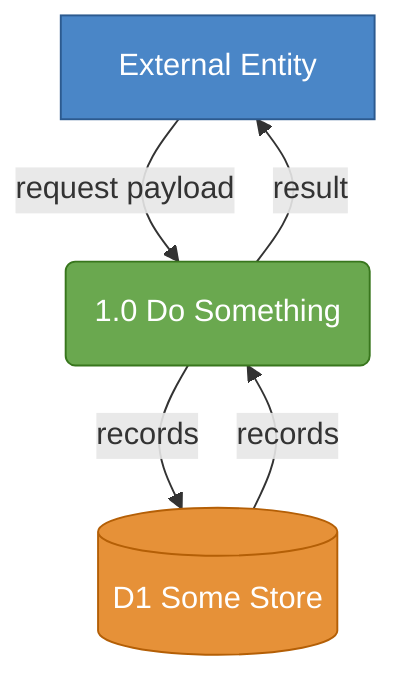
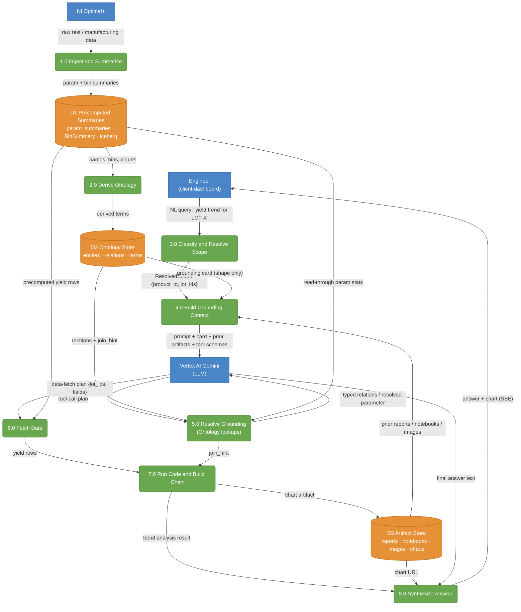

# Create Data Flow Diagram (DFD)

Turn a system description — a request/response trace, a feature, a plan, or an architecture diagram —
into a **rule-compliant Data Flow Diagram** rendered in Mermaid. A DFD models *data*, not control
flow: where data comes from, which activities transform it, what gets stored, and what consumes it.

Use this when a diagram shows boxes and arrows but a reader still cannot answer: *for a given request,
which component is called first, what does it return, what is stored, and in what order?* A DFD makes
the data movement explicit, ordered, and typed.

## When to Use This Skill

- Converting a narrative trace (e.g. "show me yield trend for lot X") into a visual data-flow model.
- Documenting how a service/feature moves data across components for a plan or design doc.
- Replacing a topology-only architecture diagram (boxes + unlabeled arrows) with real data flows.
- Reviewing a design for missing flows (a store never written, a process with no output, etc.).

## DFD Elements and Conventions

| Element | Meaning | Shape | Color |
|---|---|---|---|
| **External entity** | A source/sink outside the system (user, external API, LLM provider) | rectangle | blue |
| **Process** | An activity that transforms data; named with a **number + verb phrase** (`1.0 Ingest and Summarize`) | rounded rectangle | green |
| **Data store** | Persistent data at rest (DB table, object store, cache) | open-ended rectangle / cylinder | orange |
| **Data flow** | A labeled arrow naming the data that moves (`ResolvedScope {product_id, lot_ids}`) | directed edge | — |

Every arrow **must be labeled** with the data it carries. Prefer typed payloads where the source
material is typed (e.g. `OntologyRelationView[]`, not "relations").

## The 7 DFD Rules (enforce all of these)

1. Data must **not** flow between two external entities.
2. Data must **not** flow between two data stores.
3. Data must **not** flow from an external entity directly to a data store (route it through a process).
4. Every process **must** have at least one input **and** one output flow.
5. Every data store **must** have at least one input **and** one output flow.
6. The number of processes **should not** exceed twelve (a Level-0 diagram; decompose further if needed).
7. Every process **must** be linked to at least one data store **or** another process.

Rule 5 is the most common trap: if your diagram reads a store but nothing in scope writes it,
**include the upstream writer process** (ingestion, derivation, etc.). This also answers "where does
the data come from," so it is usually the right call rather than a workaround.

## Process

### 1. Gather inputs

- The trace / feature / plan / architecture to model.
- If the user supplies **DFD rule or example images**, read them first and follow their conventions
  (colors, shapes, numbering) over the defaults above.
- Identify the system boundary: what is inside (processes, stores) vs outside (external entities).

### 2. Extract the four element types

- **External entities:** who initiates the request, who receives the result, and any third-party
  service that exchanges data (e.g. an LLM provider, a payment gateway, a source API). The LLM in an
  agentic system is an **external entity** — model the agent's tool-calls as flows to/from it.
- **Processes:** each activity that transforms data. Name each `N.0 <verb phrase>`. Merge trivial
  adjacent steps to stay within 12; split an overloaded process into a Level-1 diagram if needed.
- **Data stores:** every place data rests (tables, object store, caches). Name and number them
  (`D1`, `D2`, …).
- **Data flows:** the named payload on each arrow.

### 3. Wire the flows and enforce the rules

- Draw every flow entity→process, process→process, process→store, store→process. **Never**
  entity→entity, store→store, or entity→store.
- For each process, confirm ≥1 input and ≥1 output. For each store, confirm ≥1 input and ≥1 output —
  pull in upstream writer processes if a store would otherwise be read-only.
- For agentic / LLM loops: show `build-context → LLM (entity) → resolve/ground (process) → LLM →
  fetch-data (process) → …` so push-before-pull and ontology-before-data ordering is visible.

### 4. Render in Mermaid

Use a `flowchart TD` (or `LR`) with three `classDef`s. Quote edge labels that contain `{}`, `,`,
`(`, or `:`. Use cylinders `[(...)]` for stores, rounded `(...)` for processes, `["..."]` for
entities. Avoid raw `&` in labels (use "and").

### 5. Validate before delivering

Run the checklist (below). Fix any violation. If the user provided example/rules images, re-check the
diagram matches their conventions.

### 6. Deliver

- Output the Mermaid block.
- Add a short **element → source-step → owner** mapping table so the diagram ties back to the trace
  or codebase it models.
- If a plan/design doc is in play, offer to embed the diagram there (and sync, if the repo uses a
  thoughts/docs sync).
- Offer variants: a tighter **Level-1** (request-only) diagram, or a separate diagram for an
  alternate path.

## Validation Checklist

- [ ] No entity→entity, store→store, or entity→store flows (rules 1–3).
- [ ] Every process has ≥1 input and ≥1 output (rule 4).
- [ ] Every data store has ≥1 input and ≥1 output — upstream writer included if needed (rule 5).
- [ ] ≤12 processes (rule 6); decompose to Level-1 otherwise.
- [ ] Every process links to a store or another process (rule 7).
- [ ] Every arrow is labeled with the data it carries; typed where the source is typed.
- [ ] Processes are numbered verb phrases; entities/stores are named and numbered.
- [ ] Colors/shapes match the provided example (or the default entity=blue, process=green, store=orange).
- [ ] The diagram answers: what is called first, what it returns, what is stored, in what order.

## Worked Example (template)

Trace: *"show me yield trend for lot X"* in an ontology-grounded chat agent. The LLM (Vertex) is an
external entity; the agentic loop's tool-calls are flows to/from it. Upstream ingestion/derivation
processes are included so the stores have a populating input (rule 5) and provenance is visible.

Note how the rules force clarity: the LLM-as-entity + push-before-pull ordering makes "which service
first" explicit; including `1.0`/`2.0` gives `D1`/`D2` their required inputs and shows provenance; and
the bidirectional `D3` (written by `7.0`, read by `4.0` and `8.0`) captures that prior artifacts feed
context as well as being produced by the turn.

## Notes and Pitfalls

- **A DFD is not a flowchart or sequence diagram.** Do not model conditionals/loops as control flow;
  model the data that moves. Ordering is conveyed by the chain of flows, not by branch logic.
- **Agentic loops:** the LLM is external; its tool selection appears as `process → LLM → process`.
  Don't hide the loop inside one "Agent processes context" blob — that is the anti-pattern this skill
  exists to fix.
- **Keep Level-0 to ≤12 processes.** If a process is doing too much, note it and offer a Level-1
  decomposition rather than cramming.
- **Label everything.** An unlabeled arrow is a defect, not a shortcut.
